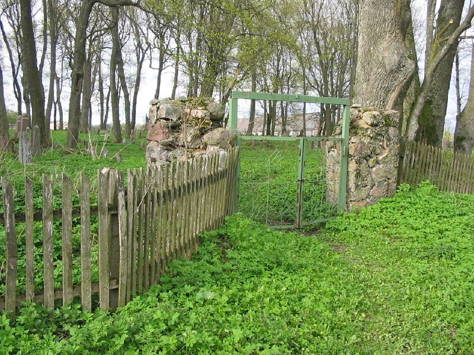
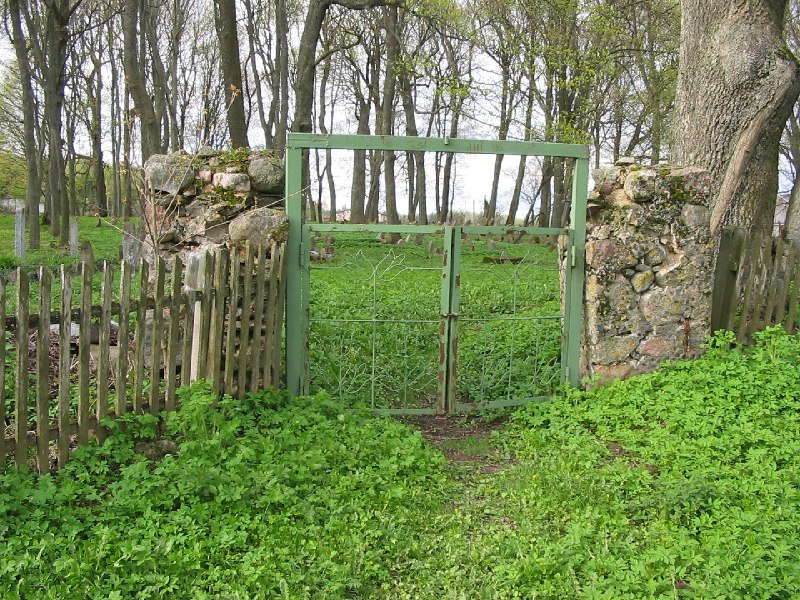
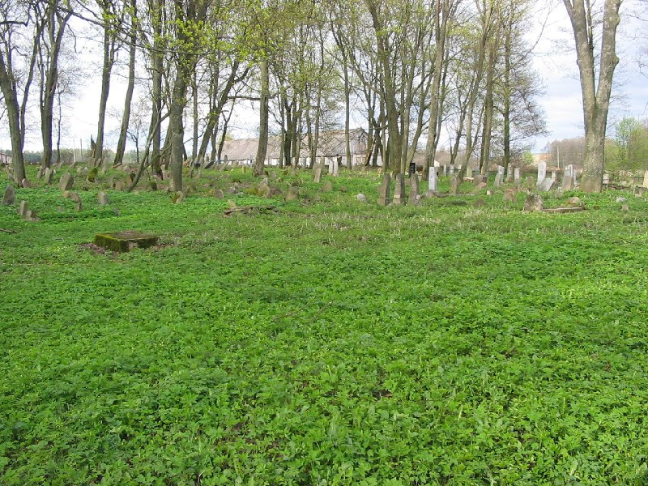
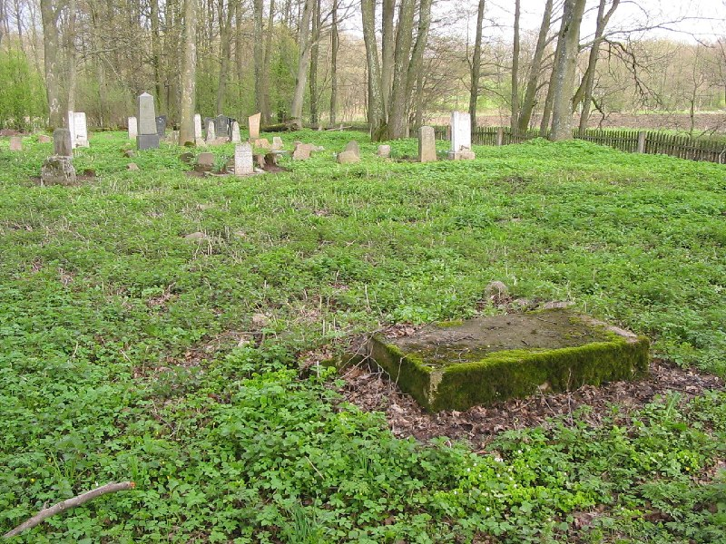
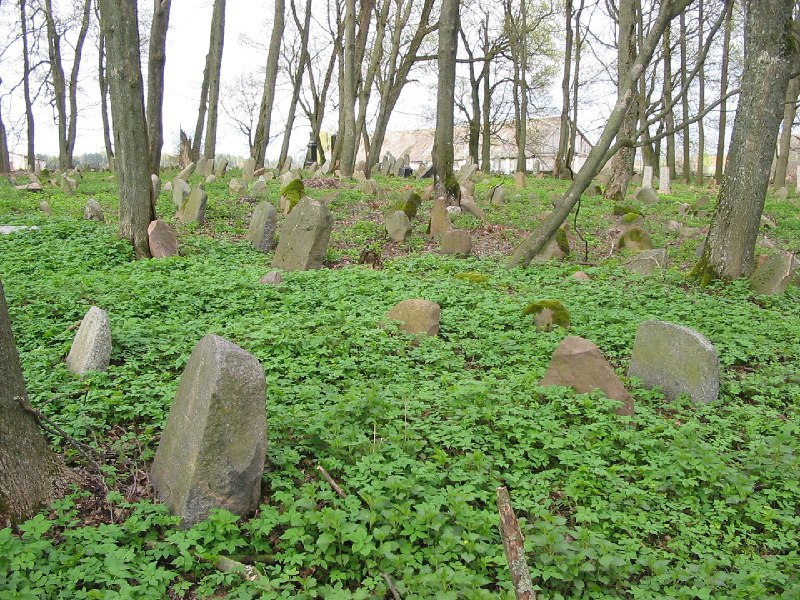
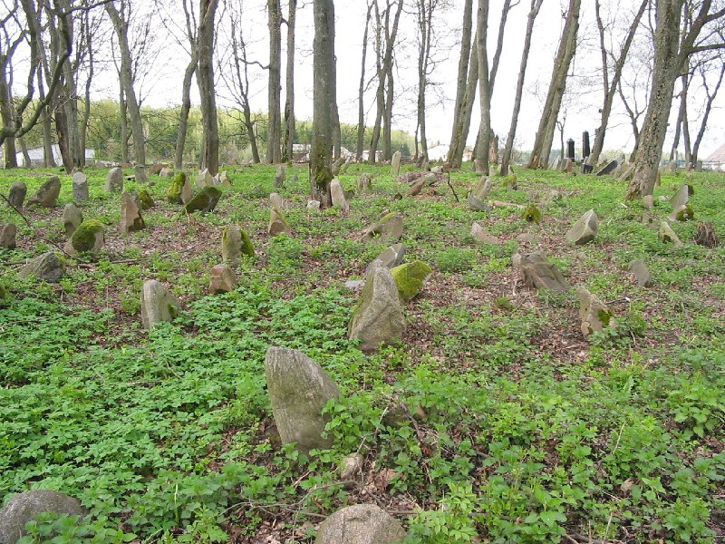
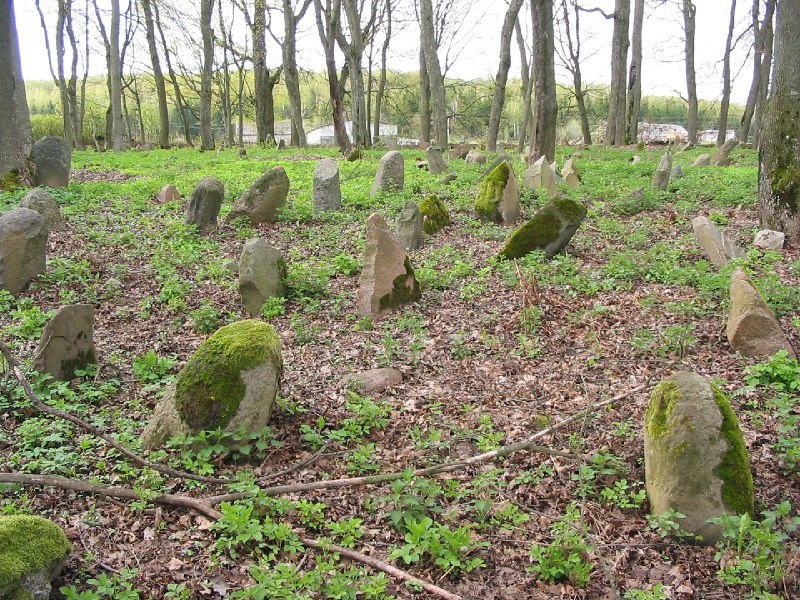
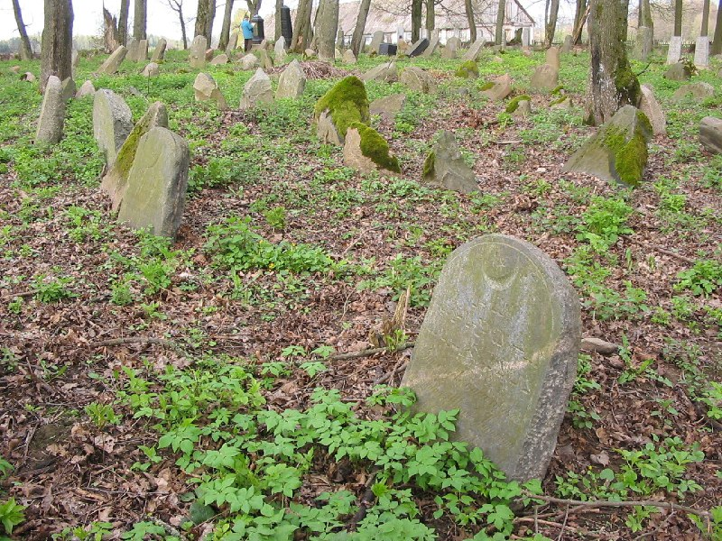
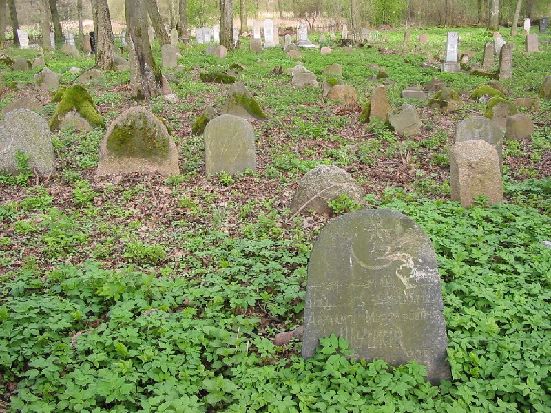
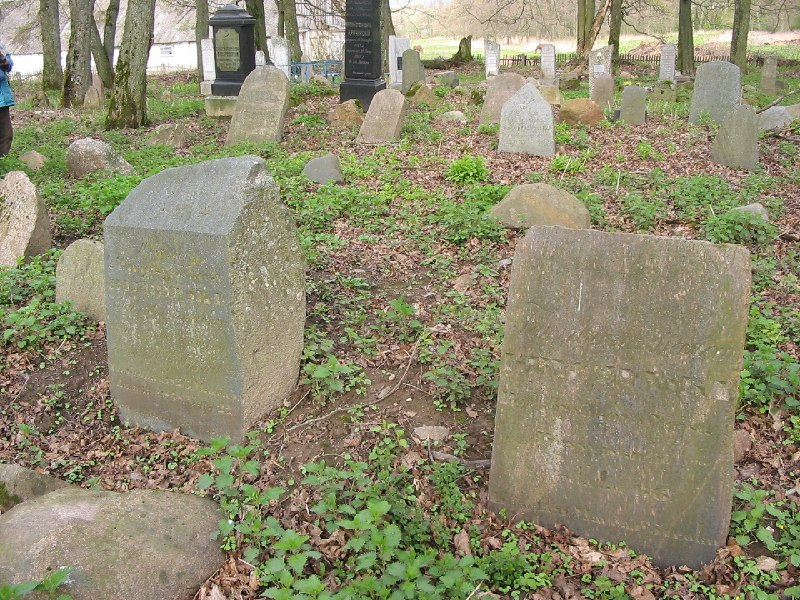

+++
title = "052-270 Довбучки, снято 7 мая 2005.jpg"
date = 2026-03-02T13:31:54+00:00
description = "052-270 Довбучки, снято 7 мая 2005.jpg cementery abandone belarus globustut"

[taxonomies]
tags = ["cementery", "abandone", "belarus", "globustut", "year_2005"]

[extra]
tg_url = "https://t.me/vitaly_zdanevich_chan/1309"
og_image = "01.jpg"
next_id = 1319
next_title = "052-333 Олешишки, снято 7 мая 2005.jpg"
prev_id = 1308
prev_title = "Wow in kitty we can switch to a prev active tab"
views = 6
ids = [1309]
+++

[052-270 Довбучки, снято 7 мая 2005.jpg](https://commons.wikimedia.org/wiki/File:052-270_%D0%94%D0%BE%D0%B2%D0%B1%D1%83%D1%87%D0%BA%D0%B8,_%D1%81%D0%BD%D1%8F%D1%82%D0%BE_7_%D0%BC%D0%B0%D1%8F_2005.jpg)

{{ tag(t="cementery") }}
{{ tag(t="abandone") }}
{{ tag(t="belarus") }}
{{ tag(t="globustut") }}

