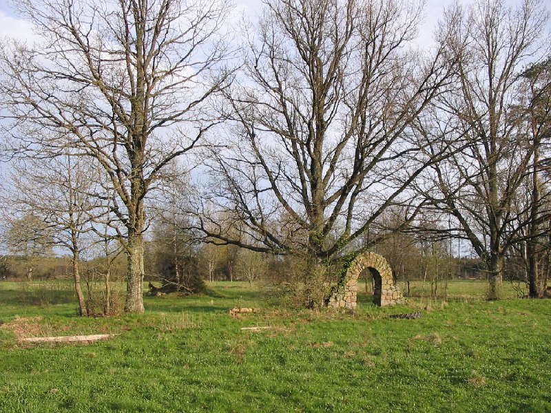
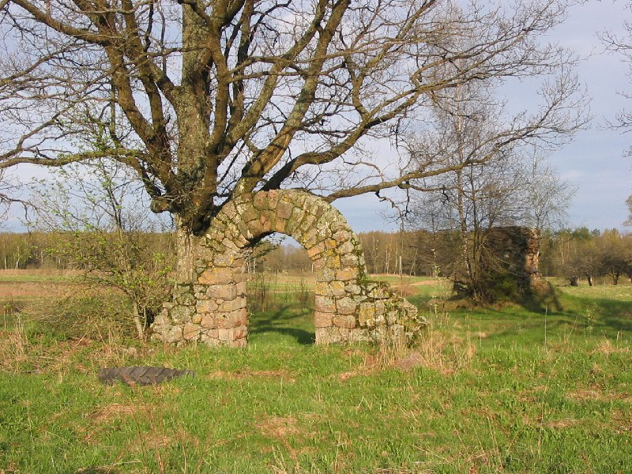
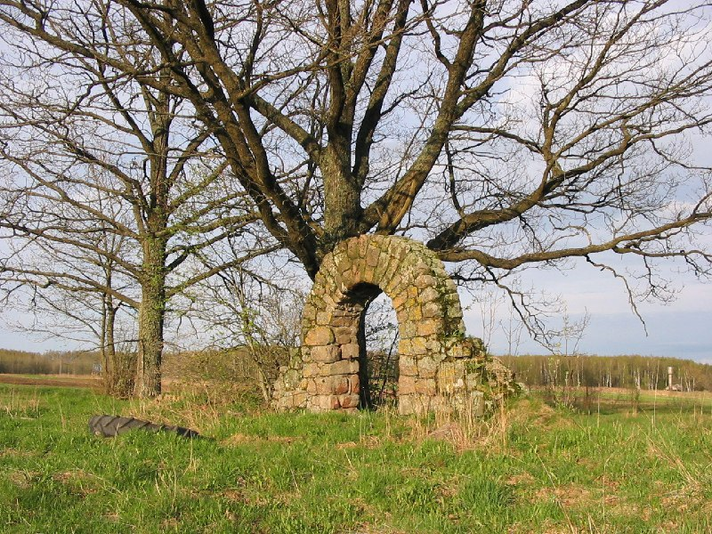
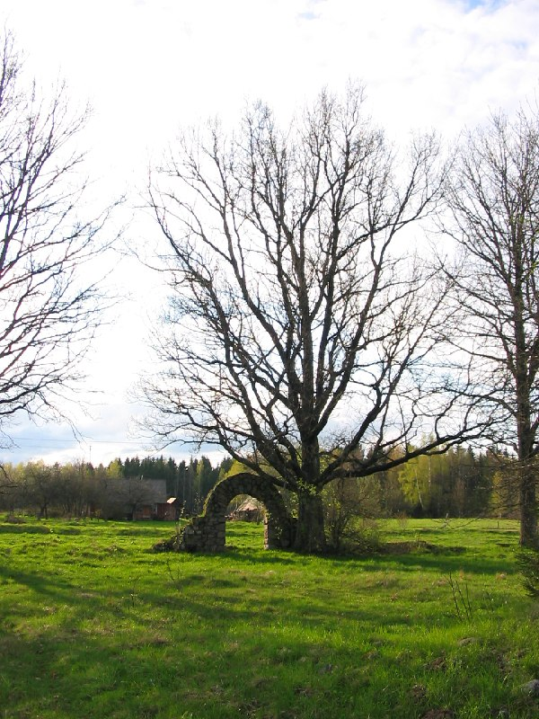
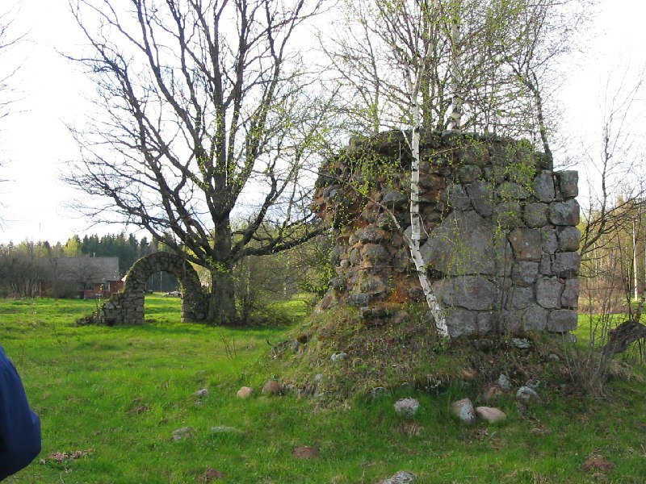
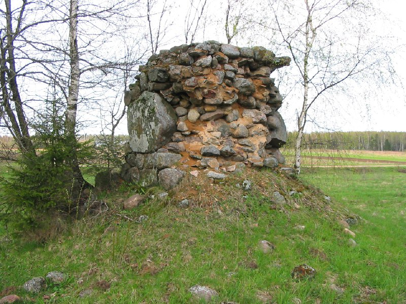
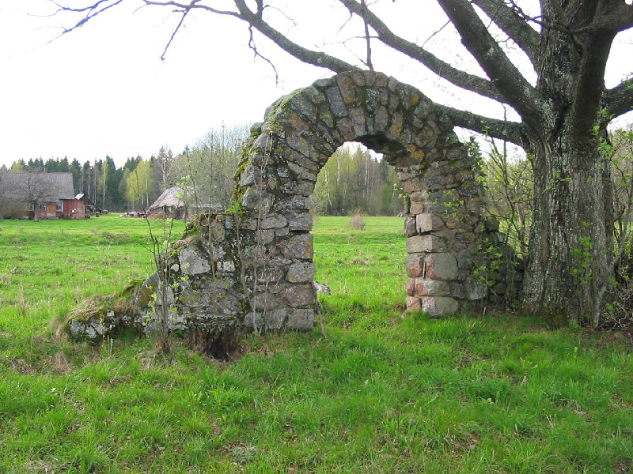
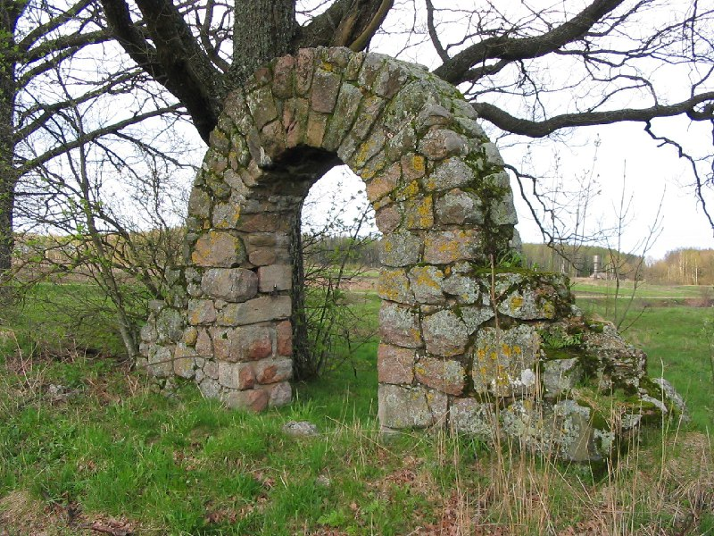
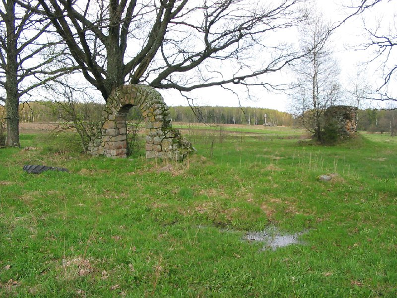

+++
title = "052-333 Олешишки, снято 7 мая 2005.jpg"
date = 2026-03-02T13:36:27+00:00
description = "052-333 Олешишки, снято 7 мая 2005.jpg arch abandone belarus globustut"

[taxonomies]
tags = ["arch", "abandone", "belarus", "globustut", "year_2005"]

[extra]
tg_url = "https://t.me/vitaly_zdanevich_chan/1319"
og_image = "01.jpg"
next_id = 1328
next_title = "052-355 Понара, снято 7 мая 2005.jpg"
prev_id = 1309
prev_title = "052-270 Довбучки, снято 7 мая 2005.jpg"
views = 9
ids = [1319]
+++

[052-333 Олешишки, снято 7 мая 2005.jpg](https://commons.wikimedia.org/wiki/File:052-333_%D0%9E%D0%BB%D0%B5%D1%88%D0%B8%D1%88%D0%BA%D0%B8,_%D1%81%D0%BD%D1%8F%D1%82%D0%BE_7_%D0%BC%D0%B0%D1%8F_2005.jpg)

{{ tag(t="arch") }}
{{ tag(t="abandone") }}
{{ tag(t="belarus") }}
{{ tag(t="globustut") }}

