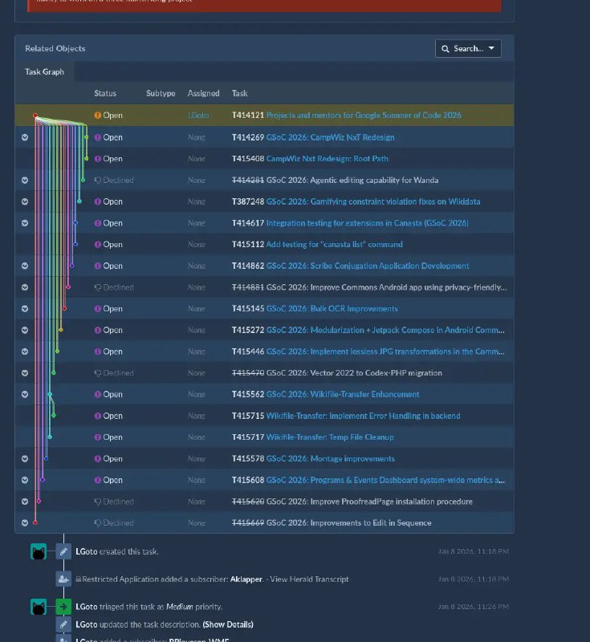

+++
title = ""
date = 2026-03-03T12:49:09+00:00
description = "design graph wikimedia"

[taxonomies]
days = ["2026-03-03"]
tags = ["design", "graph", "wikimedia"]

[extra]
id = 1333
day = "2026-03-03"
tg_url = "https://t.me/vitaly_zdanevich_chan/1333"
og_image = "5276106936908716151_1228439374_460003447.jpg"
next_id = 1334
next_title = ""
next_body = "#bash\nI love #cli, scripts, and sometimes I want my script to accept an argument that is the same as the folder name. How to pass that current folder name to the script?\nupload.py file.pdf --category \"${PWD##/}\"\nYep, it works."
prev_id = 1332
prev_title = ""
prev_body = "#logo\n#horse"
views = 11
ids = [1333]
+++

{{ tag(t="design") }}  
{{ tag(t="graph") }}  
{{ tag(t="wikimedia") }}  

<https://phabricator.wikimedia.org/T414121>

