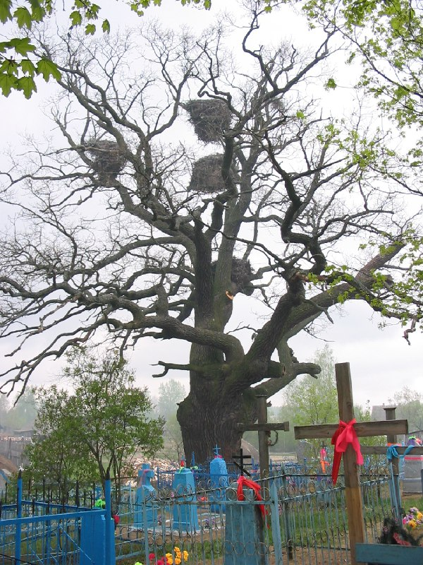

+++
title = ""
date = 2026-03-07T10:05:14+00:00
description = "nest cementery belarus globustut year2005Source"

[taxonomies]
days = ["2026-03-07"]
tags = ["nest", "cementery", "belarus", "globustut", "year_2005"]

[extra]
id = 1337
day = "2026-03-07"
tg_url = "https://t.me/vitaly_zdanevich_chan/1337"
og_image = "5287405896352863414_1231070118_460002486.jpg"
next_id = 1338
next_title = ""
prev_id = 1336
prev_title = ""
views = 5
ids = [1337]
+++

{{ tag(t="nest") }}  
{{ tag(t="cementery") }}  
{{ tag(t="belarus") }}  
{{ tag(t="globustut") }}  
{{ tag(t="year_2005") }}[Source](https://commons.wikimedia.org/wiki/File:053-029_%D0%9E%D0%B1%D1%80%D0%BE%D0%B2%D0%BE,_%D1%81%D0%BD%D1%8F%D1%82%D0%BE_9_%D0%BC%D0%B0%D1%8F_2005.jpg)

