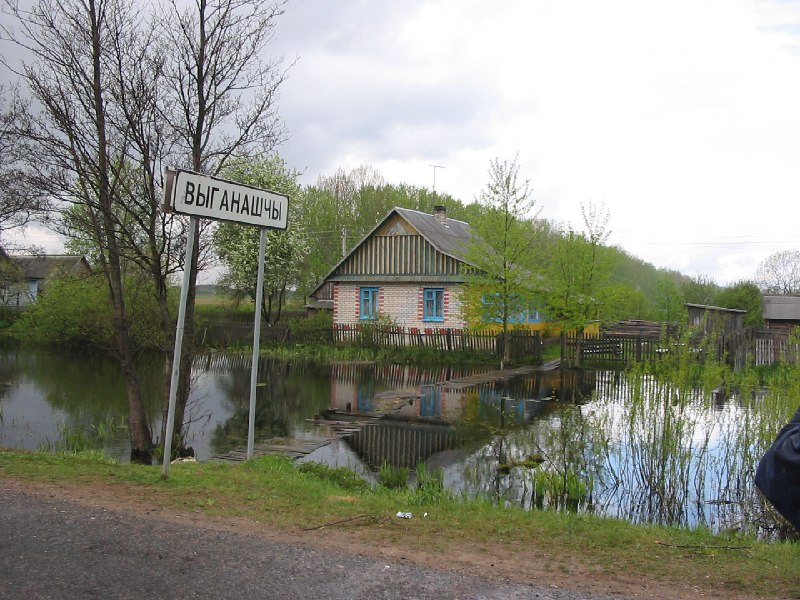
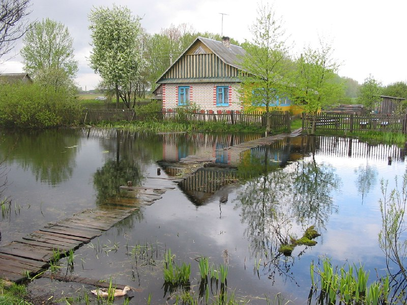

+++
title = ""
date = 2026-03-07T10:19:00+00:00
description = "house river belarus globustut Source"

[taxonomies]
days = ["2026-03-07"]
tags = ["house", "river", "belarus", "globustut"]

[extra]
id = 1338
day = "2026-03-07"
tg_url = "https://t.me/vitaly_zdanevich_chan/1338"
og_image = "01.jpg"
next_id = 1340
next_title = ""
next_body = "#art\n#shop\n#продукты\n#belarus\n#globustut\n#year2005\nSource"
prev_id = 1337
prev_title = ""
prev_body = "#nest\n#cementery\n#belarus\n#globustut\n#year2005\nSource"
views = 5
ids = [1338]
+++

{{ tag(t="house") }}  
{{ tag(t="river") }}  
{{ tag(t="belarus") }}  
{{ tag(t="globustut") }}

[Source](https://commons.wikimedia.org/wiki/File:053-129_%D0%92%D1%8B%D0%B3%D0%BE%D0%BD%D0%BE%D1%89%D0%B8,_%D0%BA%D0%B0%D0%BD%D0%B0%D0%BB_%D0%9E%D0%B3%D0%B8%D0%BD%D1%81%D0%BA%D0%BE%D0%B3%D0%BE,_%D1%81%D0%BD%D1%8F%D1%82%D0%BE_9_%D0%BC%D0%B0%D1%8F_2005.jpg)

