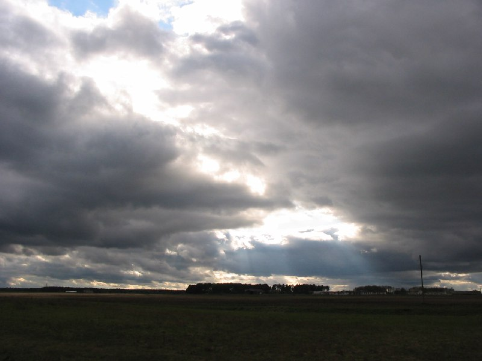

+++
title = "053-320, снято 9 мая 2005.jpg"
date = 2026-03-07T10:33:28+00:00
description = "053-320, снято 9 мая 2005.jpg clouds sun belarus globustut year2005"

[taxonomies]
tags = ["clouds", "sun", "belarus", "globustut", "year_2005"]

[extra]
tg_url = "https://t.me/vitaly_zdanevich_chan/1341"
og_image = "5287405896352863453_1231070118_460002525.jpg"
next_id = 1342
next_title = "053-461 Дубой (Пинский р-н), костел, снято 9 мая 2005.jpg"
prev_id = 1340
prev_title = "053-208 Телеханы, дом, снято 9 мая 2005.jpg"
views = 5
ids = [1341]
+++

[053-320, снято 9 мая 2005.jpg](https://commons.wikimedia.org/wiki/File:053-320,_%D1%81%D0%BD%D1%8F%D1%82%D0%BE_9_%D0%BC%D0%B0%D1%8F_2005.jpg)

{{ tag(t="clouds") }}
{{ tag(t="sun") }}
{{ tag(t="belarus") }}
{{ tag(t="globustut") }}
{{ tag(t="year_2005") }}

