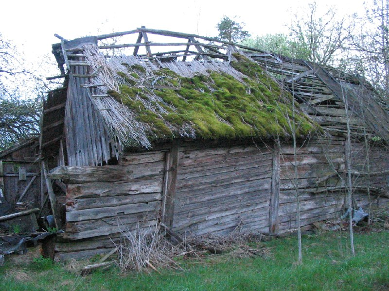

+++
title = ""
date = 2026-03-07T10:42:28+00:00
description = "house abandone belarus globustut year2005 Source,%D1%81%D0%BD%D1%8F%D1%82%D0%BE9%D0%BC%D0%B0%D1%8F2005.jpg)"

[taxonomies]
days = ["2026-03-07"]
tags = ["house", "abandone", "belarus", "globustut", "year_2005"]

[extra]
id = 1349
day = "2026-03-07"
tg_url = "https://t.me/vitaly_zdanevich_chan/1349"
og_image = "5287405896352863471_1231070118_460002543.jpg"
next_id = 1350
next_title = ""
next_body = "#cementery\n#abandone\n#belarus\n#globustut\n#year2005\nSource,%D1%81%D0%BD%D1%8F%D1%82%D0%BE9%D0%BC%D0%B0%D1%8F2005.jpg)"
prev_id = 1342
prev_title = ""
prev_body = "#church\n#abandone\n#belarus\n#globustut\n#year2005\nSource,%D0%BA%D0%BE%D1%81%D1%82%D0%B5%D0%BB,%D1%81%D0%BD%D1%8F%D1%82%D0%BE9%D0%BC%D0%B0%D1%8F2005.jpg)"
views = 6
ids = [1349]
+++

{{ tag(t="house") }}  
{{ tag(t="abandone") }}  
{{ tag(t="belarus") }}  
{{ tag(t="globustut") }}  
{{ tag(t="year_2005") }}

[Source](https://commons.wikimedia.org/wiki/File:053-487_%D0%94%D1%83%D0%B1%D0%BE%D0%B9_(%D0%9F%D0%B8%D0%BD%D1%81%D0%BA%D0%B8%D0%B9_%D1%80-%D0%BD),_%D1%81%D0%BD%D1%8F%D1%82%D0%BE_9_%D0%BC%D0%B0%D1%8F_2005.jpg)

