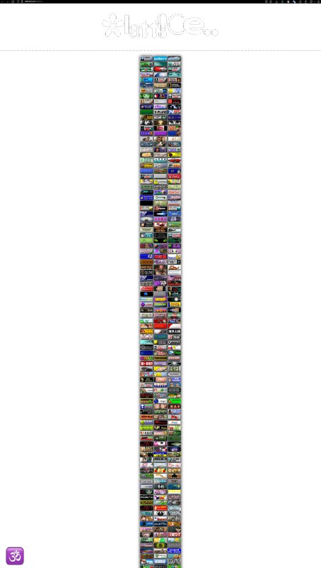

+++
title = ""
date = 2026-03-08T07:25:04+00:00
description = "button"

[taxonomies]
days = ["2026-03-08"]
tags = ["button"]

[extra]
id = 1371
day = "2026-03-08"
tg_url = "https://t.me/vitaly_zdanevich_chan/1371"
og_image = "5289657696166549213_1231594406_460003037.jpg"
next_id = 1372
next_title = ""
next_body = "#architecture\n#orange\n#columns\n#belarus\n#globustut\n#year2005\nSource26(%D0%B2%D0%B8%D0%B4%D0%B8%D0%BC%D0%BE),%D1%81%D0%BD%D1%8F%D1%82%D0%BE29%D0%BC%D0%B0%D1%8F2005.jpg)"
prev_id = 1370
prev_title = ""
prev_body = "#webdesign\n#armenia"
views = 8
ids = [1371]
+++

{{ tag(t="button") }}  

<https://lattice9.net/buttons>

