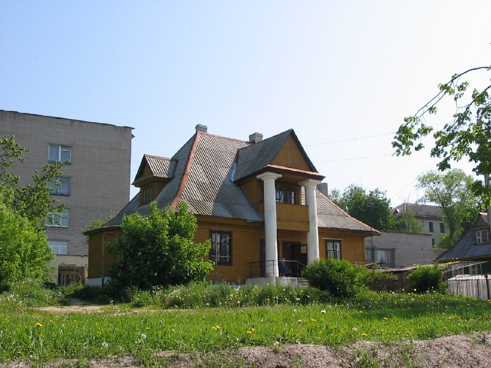

+++
title = "055-030 Новогрудок, Советская (видимо) 26 (видимо), снято 29 мая 2005.jpg"
date = 2026-03-08T07:50:12+00:00
description = "055-030 Новогрудок, Советская (видимо) 26 (видимо), снято 29 мая 2005.jpg architecture orange columns belarus globustut"

[taxonomies]
tags = ["architecture", "orange", "columns", "belarus", "globustut", "year_2005"]

[extra]
tg_url = "https://t.me/vitaly_zdanevich_chan/1372"
og_image = "5291909495980233654_1232118694_460002230.jpg"
next_id = 1373
next_title = "055-054 Новогрудок, надмогилья Дыбовских, снято 29 мая 2005.jpg"
prev_id = 1371
prev_title = "button"
views = 9
ids = [1372]
+++

[055-030 Новогрудок, Советская (видимо) 26 (видимо), снято 29 мая 2005.jpg](https://commons.wikimedia.org/wiki/File:055-030_%D0%9D%D0%BE%D0%B2%D0%BE%D0%B3%D1%80%D1%83%D0%B4%D0%BE%D0%BA,_%D0%A1%D0%BE%D0%B2%D0%B5%D1%82%D1%81%D0%BA%D0%B0%D1%8F_%28%D0%B2%D0%B8%D0%B4%D0%B8%D0%BC%D0%BE%29_26_%28%D0%B2%D0%B8%D0%B4%D0%B8%D0%BC%D0%BE%29,_%D1%81%D0%BD%D1%8F%D1%82%D0%BE_29_%D0%BC%D0%B0%D1%8F_2005.jpg)

{{ tag(t="architecture") }}
{{ tag(t="orange") }}
{{ tag(t="columns") }}
{{ tag(t="belarus") }}
{{ tag(t="globustut") }}

