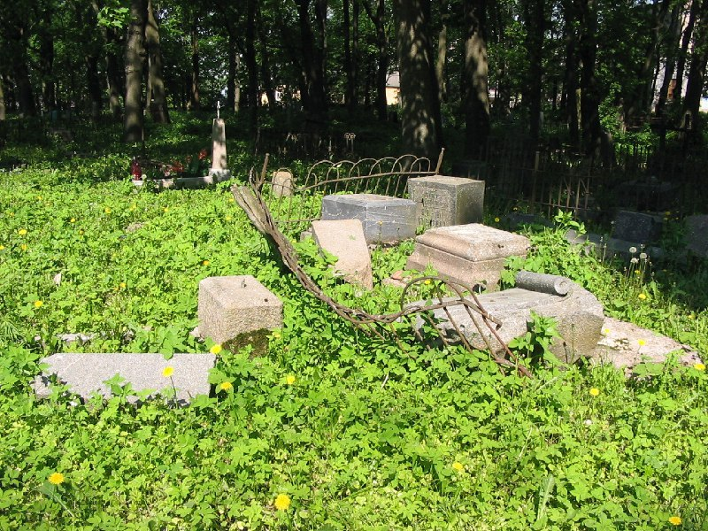
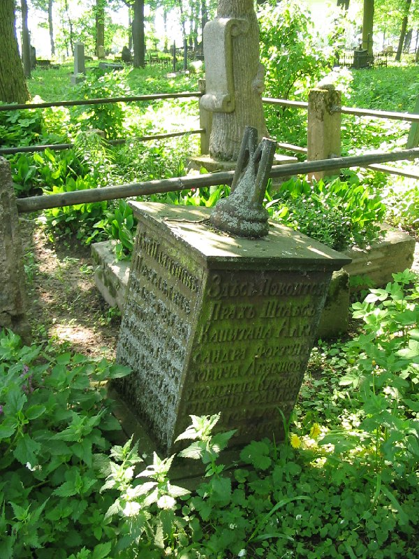
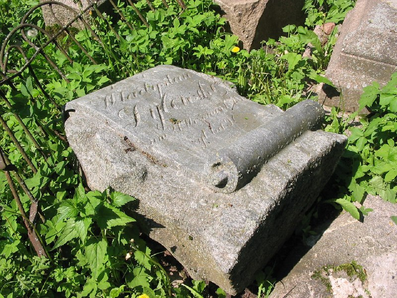
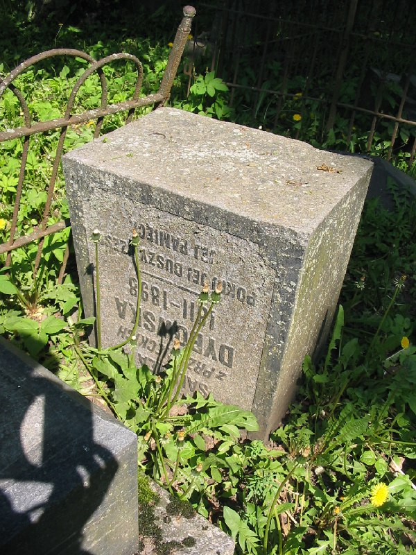
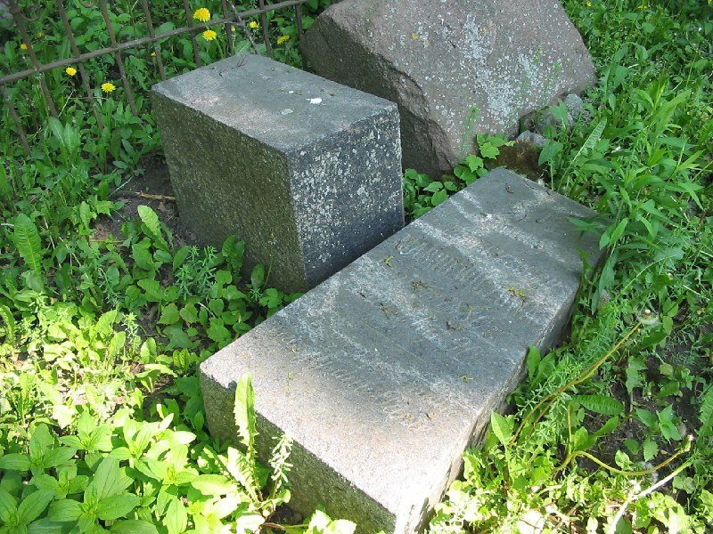
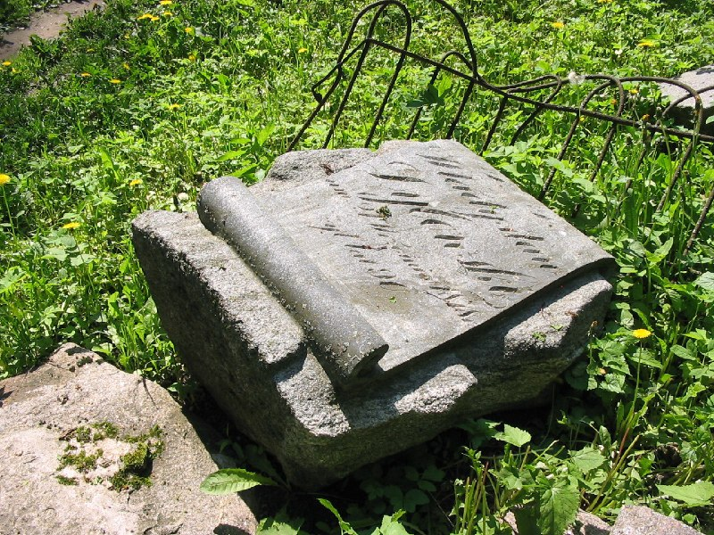
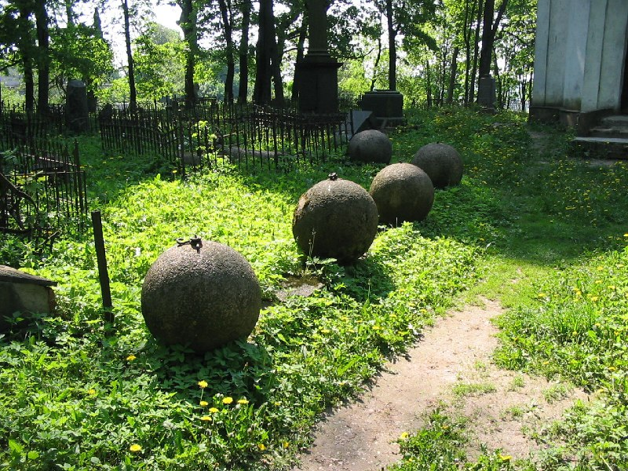
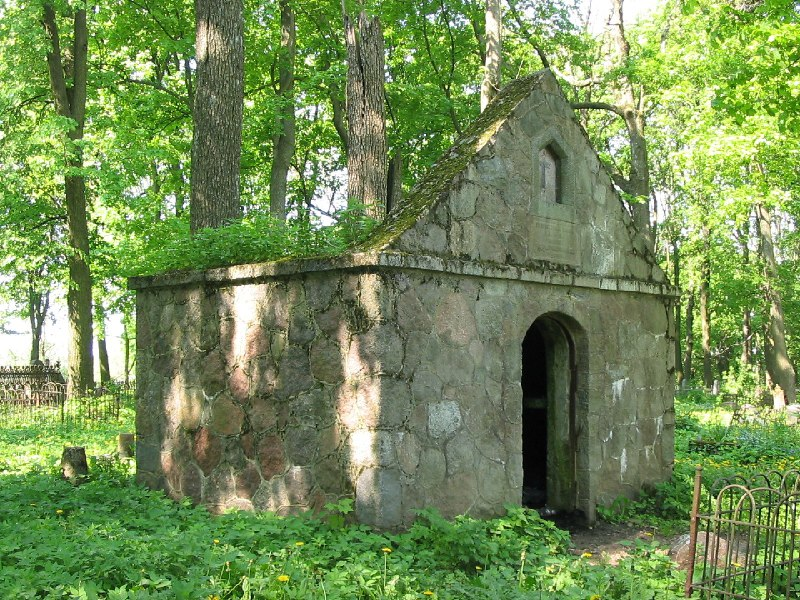
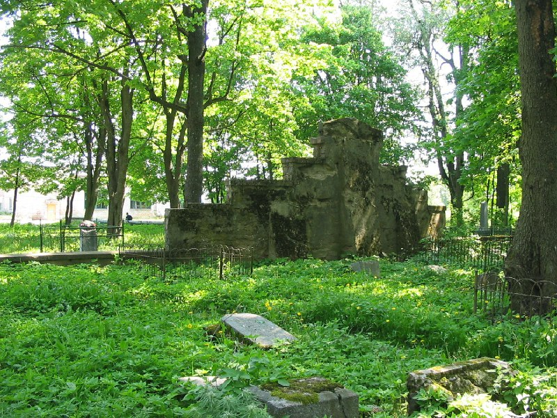

+++
title = ""
date = 2026-03-08T07:57:32+00:00
description = "cementery belarus globustut year2005 Source"

[taxonomies]
days = ["2026-03-08"]
tags = ["cementery", "belarus", "globustut", "year_2005"]

[extra]
id = 1373
day = "2026-03-08"
tg_url = "https://t.me/vitaly_zdanevich_chan/1373"
og_image = "01.jpg"
next_id = 1382
next_title = ""
next_body = "#castle\n#abandone\n#belarus\n#globustut\n#year2005\nSource"
prev_id = 1372
prev_title = ""
prev_body = "#architecture\n#orange\n#columns\n#belarus\n#globustut\n#year2005\nSource26(%D0%B2%D0%B8%D0%B4%D0%B8%D0%BC%D0%BE),%D1%81%D0%BD%D1%8F%D1%82%D0%BE29%D0%BC%D0%B0%D1%8F2005.jpg)"
views = 12
ids = [1373]
+++

{{ tag(t="cementery") }}  
{{ tag(t="belarus") }}  
{{ tag(t="globustut") }}  
{{ tag(t="year_2005") }}  

[Source](https://commons.wikimedia.org/wiki/File:055-054_%D0%9D%D0%BE%D0%B2%D0%BE%D0%B3%D1%80%D1%83%D0%B4%D0%BE%D0%BA,_%D0%BD%D0%B0%D0%B4%D0%BC%D0%BE%D0%B3%D0%B8%D0%BB%D1%8C%D1%8F_%D0%94%D1%8B%D0%B1%D0%BE%D0%B2%D1%81%D0%BA%D0%B8%D1%85,_%D1%81%D0%BD%D1%8F%D1%82%D0%BE_29_%D0%BC%D0%B0%D1%8F_2005.jpg)

