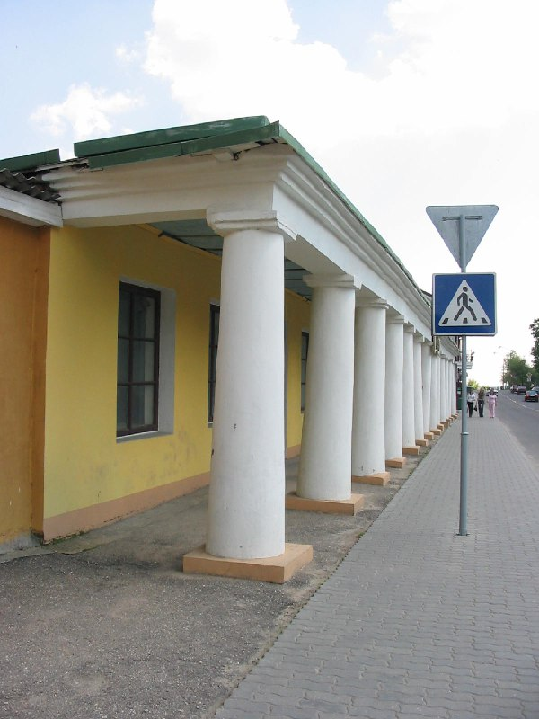

+++
title = ""
date = 2026-03-08T08:31:45+00:00
description = "columns belarus globustut year2005Source,%D1%81%D0%BD%D1%8F%D1%82%D0%BE29%D0%BC%D0%B0%D1%8F2005.jpg)"

[taxonomies]
days = ["2026-03-08"]
tags = ["columns", "belarus", "globustut", "year_2005"]

[extra]
id = 1387
day = "2026-03-08"
tg_url = "https://t.me/vitaly_zdanevich_chan/1387"
og_image = "5291909495980233793_1232118694_460002369.jpg"
next_id = 1388
next_title = ""
prev_id = 1386
prev_title = ""
views = 10
ids = [1387]
+++

{{ tag(t="columns") }}  
{{ tag(t="belarus") }}  
{{ tag(t="globustut") }}  
{{ tag(t="year_2005") }}[Source](https://commons.wikimedia.org/wiki/File:055-247_%D0%9D%D0%BE%D0%B2%D0%BE%D0%B3%D1%80%D1%83%D0%B4%D0%BE%D0%BA,_%D1%82%D0%BE%D1%80%D0%B3%D0%BE%D0%B2%D1%8B%D0%B5_%D1%80%D1%8F%D0%B4%D1%8B_(%EA%9E%8B%EA%9E%8B%D0%BC%D0%B0%D0%BB%D1%8B%D0%B5%EA%9E%8B%EA%9E%8B),_%D1%81%D0%BD%D1%8F%D1%82%D0%BE_29_%D0%BC%D0%B0%D1%8F_2005.jpg)

