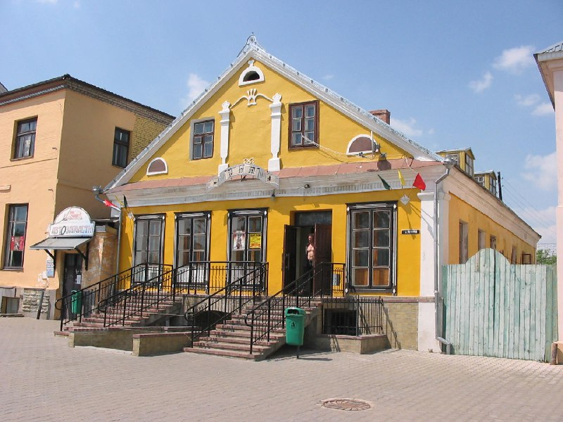

+++
title = ""
date = 2026-03-08T08:33:46+00:00
description = "architecture orange belarus globustut year2005Source"

[taxonomies]
days = ["2026-03-08"]
tags = ["architecture", "orange", "belarus", "globustut", "year_2005"]

[extra]
id = 1388
day = "2026-03-08"
tg_url = "https://t.me/vitaly_zdanevich_chan/1388"
og_image = "5291909495980233800_1232118694_460002376.jpg"
next_id = 1389
next_title = ""
prev_id = 1387
prev_title = ""
views = 10
ids = [1388]
+++

{{ tag(t="architecture") }}
{{ tag(t="orange") }}
{{ tag(t="belarus") }}
{{ tag(t="globustut") }}
{{ tag(t="year_2005") }}[Source](https://commons.wikimedia.org/wiki/File:055-254_%D0%9D%D0%BE%D0%B2%D0%BE%D0%B3%D1%80%D1%83%D0%B4%D0%BE%D0%BA,_%D0%B4%D0%BE%D0%BC_%D0%BD%D0%B0_%D0%BF%D0%BB_%D0%9B%D0%B5%D0%BD%D0%B8%D0%BD%D0%B0,_%D1%81%D0%BD%D1%8F%D1%82%D0%BE_29_%D0%BC%D0%B0%D1%8F_2005.jpg)

