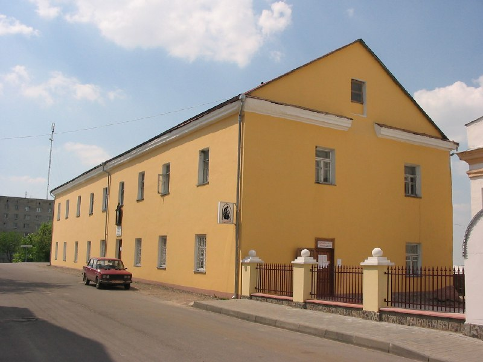

+++
title = ""
date = 2026-03-08T08:36:12+00:00
description = "building orange новогрудок belarus globustut year2005 Source"

[taxonomies]
days = ["2026-03-08"]
tags = ["building", "orange", "новогрудок", "belarus", "globustut", "year_2005"]

[extra]
id = 1389
day = "2026-03-08"
tg_url = "https://t.me/vitaly_zdanevich_chan/1389"
og_image = "5291909495980233809_1232118694_460002385.jpg"
next_id = 1390
next_title = ""
next_body = "#architecture\n#bricks\n#brown\n#новогрудок\n#belarus\n#globustut\n#year2005\nSource"
prev_id = 1388
prev_title = ""
prev_body = "#architecture\n#orange\n#belarus\n#globustut\n#year2005\nSource"
views = 10
ids = [1389]
+++

{{ tag(t="building") }}  
{{ tag(t="orange") }}  
{{ tag(t="новогрудок") }}  
{{ tag(t="belarus") }}  
{{ tag(t="globustut") }}  
{{ tag(t="year_2005") }}

[Source](https://commons.wikimedia.org/wiki/File:055-270_%D0%9D%D0%BE%D0%B2%D0%BE%D0%B3%D1%80%D1%83%D0%B4%D0%BE%D0%BA,_%D0%BC%D0%BE%D0%BD%D0%B0%D1%81%D1%82%D1%8B%D1%80%D1%8C_%D1%84%D1%80%D0%B0%D0%BD%D1%86%D0%B8%D1%81%D0%BA%D0%B0%D0%BD%D1%86%D0%B5%D0%B2,_%D1%81%D0%BD%D1%8F%D1%82%D0%BE_29_%D0%BC%D0%B0%D1%8F_2005.jpg)

