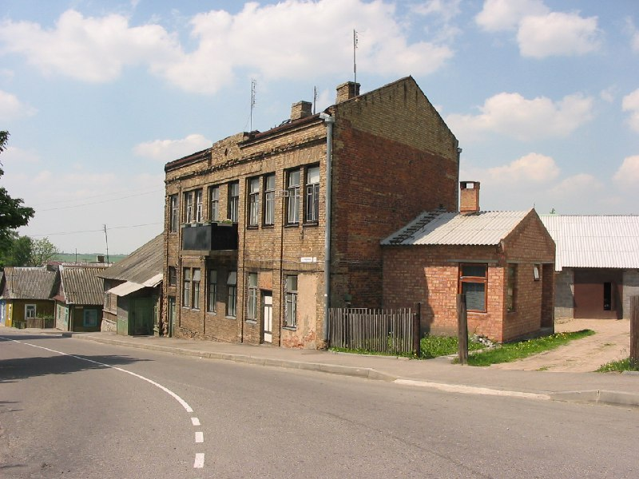
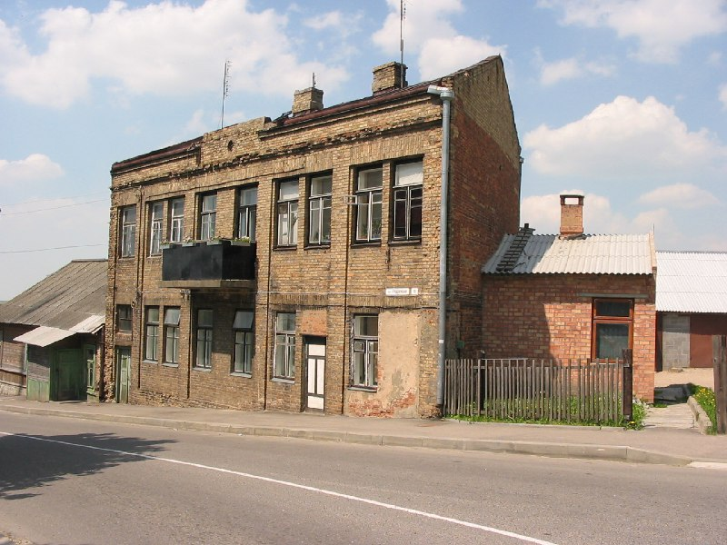

+++
title = ""
date = 2026-03-08T08:39:24+00:00
description = "architecture bricks brown новогрудок belarus globustut year2005 Source"

[taxonomies]
days = ["2026-03-08"]
tags = ["architecture", "bricks", "brown", "новогрудок", "belarus", "globustut", "year_2005"]

[extra]
id = 1390
day = "2026-03-08"
tg_url = "https://t.me/vitaly_zdanevich_chan/1390"
og_image = "01.jpg"
next_id = 1392
next_title = ""
next_body = "#webdesign\n#oldweb"
prev_id = 1389
prev_title = ""
prev_body = "#building\n#orange\n#новогрудок\n#belarus\n#globustut\n#year2005\nSource"
views = 10
ids = [1390]
+++

{{ tag(t="architecture") }}  
{{ tag(t="bricks") }}  
{{ tag(t="brown") }}  
{{ tag(t="новогрудок") }}  
{{ tag(t="belarus") }}  
{{ tag(t="globustut") }}  
{{ tag(t="year_2005") }}

[Source](https://commons.wikimedia.org/wiki/File:055-274_%D0%9D%D0%BE%D0%B2%D0%BE%D0%B3%D1%80%D1%83%D0%B4%D0%BE%D0%BA,_%D0%93%D1%80%D0%BE%D0%B4%D0%BD%D0%B5%D0%BD%D1%81%D0%BA%D0%B0%D1%8F_12,_%D1%81%D0%BD%D1%8F%D1%82%D0%BE_29_%D0%BC%D0%B0%D1%8F_2005.jpg)

