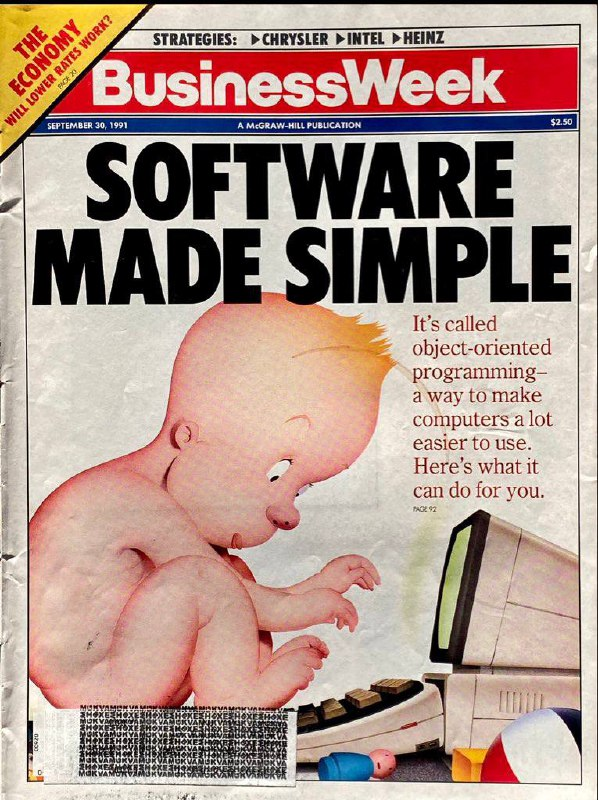

+++
title = ""
date = 2026-03-08T15:42:57+00:00
description = "Да, нейросети упрощают разработку. Нет, профессия программиста останется. Для тех, кто боится за профессию: хайп Объектно Ориентированного Программирования, Сентябрь 1991. Кстати, на фоне ассемблера…"

[taxonomies]
days = ["2026-03-08"]

[extra]
id = 1395
day = "2026-03-08"
tg_url = "https://t.me/vitaly_zdanevich_chan/1395"
og_image = "5222211629989173114_1215890895_460003194.jpg"
next_id = 1396
next_title = ""
next_body = ""
prev_id = 1394
prev_title = ""
prev_body = "Кто-то сделал полноценный 3D-симулятор электрических цепей, который работает прямо в браузере\nСтек: Three.js (r3f) + эмуляция Arduino (AVR8js от Wokwi) + симуляция аналоговой части (как в Falstad).\nСамое крутое — это объединение всего в 3D. Теперь можно симмулировать микроконтроллер и аналоговую схему прямо в браузере с красивой графикой. Раньше такое было возможно только в тяжелом софте вроде Proteus или LTspice\nПример на видео: ссылка\n#сервисы@daniilak"
views = 10
forwarded_from = "запуск завтра"
forwarded_from_url = "https://t.me/ctodaily/2017"
ids = [1395]
+++

Да, нейросети упрощают разработку.  

Нет, профессия программиста останется.  

Для тех, кто боится за профессию: хайп Объектно Ориентированного Программирования, Сентябрь 1991.  

Кстати, на фоне ассемблера и С — это реально был прорыв, радикально снизил порог входа в профессию и увеличил производительность. И мы стали разрабатывать в десятки раз больше софта. Ничего не напоминает? :)  

Ну или нейросети так изменят всю интеллектуальную работу (и работу в целом), что проблемы с рынком разработки ПО будут меньшей из наших бед. Соль, спички, вот это все.

