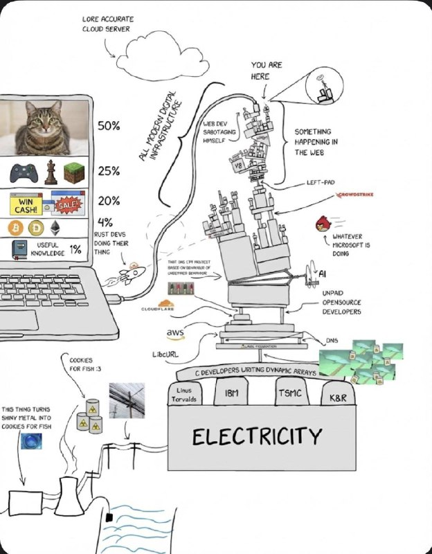

+++
title = ""
date = 2026-03-08T17:26:25+00:00

[taxonomies]
days = ["2026-03-08"]

[extra]
id = 1405
day = "2026-03-08"
tg_url = "https://t.me/vitaly_zdanevich_chan/1405"
og_image = "5267116732839563881_1226346179_460001897.jpg"
next_id = 1406
next_title = ""
next_body = "Норвежский стартап 1X начал принимать предзаказы на первых в мире роботов для уборки домов и квартир\nРобот по имени NEO умеет стирать, мыть посуду и переносить вещи весом до 25 килограммов. Он также может общаться с людьми, шутить и рассказывать сказки детям. Устройство работает почти бесшумно, самостоятельно заряжается и способно обучаться новым задачам. Робота можно купить за 20 тысяч долларов или арендовать за 500 долларов в месяц.\nЕсли я его куплю, он сможет устроиться вместо меня на работу или выполнять другую деятельность?"
prev_id = 1404
prev_title = ""
prev_body = "Микросервисы повышают устойчивость системы. Падение одного сервиса не означает полный отказ всей системы. Его можно временно отключить. Остальные компоненты продолжают работать.\nКаждый микросервис решает конкретную бизнес-задачу. Платежи, заказы, уведомления — это отдельные сервисы. Четкие границы ответственности упрощают понимание системы.\nНастоящий ООП — это микросервисы. Инкапсуляция и строгие интерфейсы реализованы на уровне архитектуры. Сервис скрывает свою реализацию и предоставляет только интерфейс в виде API\nДокументация в README обязательна. В ней должна быть описана бизнес-логика сервиса, а не только инструкция по запуску. Это спасает, когда нужно внести изменения спустя месяцы.\nМикросервисы — это управляемая сложность. Система становится модульной и предсказуемой\nПока без хештега..."
views = 13
forwarded_from = "Daniilak — Канал"
forwarded_from_url = "https://t.me/daniilak/1602"
ids = [1405]
+++

