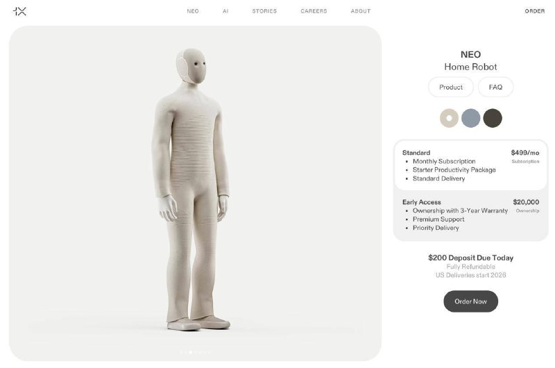

+++
title = "Норвежский стартап 1X начал принимать предзаказы на первых в мире роботов для уборки домов и квартир"
date = 2026-03-08T17:31:50+00:00
description = "Робот по имени NEO умеет стирать, мыть посуду и переносить вещи весом до 25 килограммов. Он также может общаться с людьми, шутить и рассказывать сказки детям. Устройство работает почти бесшумно,…"

[taxonomies]
tags = ["video"]

[extra]
tg_url = "https://t.me/vitaly_zdanevich_chan/1406"
og_image = "01.jpg"
next_id = 1408
next_title = "Энтузиасты собрали ИИ-пайплайн, который из хаотичного потока данных мыши восстанавливает речь с точностью на тестах 42–61% (пример в конце видео)"
prev_id = 1405
prev_title = "2026-03-08 17:26"
views = 14
forwarded_from = "Daniilak — Канал"
forwarded_from_url = "https://t.me/daniilak/1555"
ids = [1406]
+++

Робот по имени NEO умеет стирать, мыть посуду и переносить вещи весом до 25 килограммов. Он также может общаться с людьми, шутить и рассказывать сказки детям. Устройство работает почти бесшумно, самостоятельно заряжается и способно обучаться новым задачам. Робота можно купить за 20 тысяч долларов или арендовать за 500 долларов в месяц.

Если я его куплю, он сможет устроиться вместо меня на работу или выполнять другую деятельность?

{{ video(src="02.mp4") }}

{{ tag(t="video") }}
