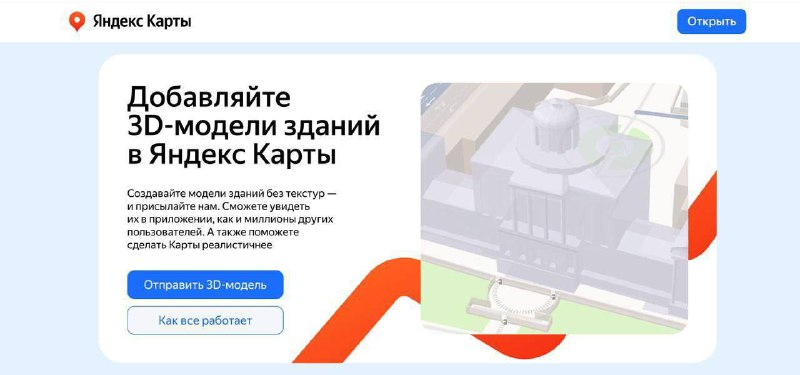

+++
title = ""
date = 2026-03-08T17:46:25+00:00
description = "Теперь в Яндекс Карты можно добавлять собственные 3D-модели зданий и ориентиров: от памятников до узнаваемых домов в районе. Архитекторы могут поделиться трёхмерными моделями своих реализованных…"

[taxonomies]
days = ["2026-03-08"]

[extra]
id = 1411
day = "2026-03-08"
tg_url = "https://t.me/vitaly_zdanevich_chan/1411"
og_image = "5312387973058264486_1236886711_456261030.jpg"
next_id = 1412
next_title = ""
next_body = "Любая фотография города с современного смартфона с 2024 года — это не реальное фото. Это предсказание нейросети о том, как, по её мнению, этот момент должен был выглядеть.\nОна цензурирует реальность: убирает шумы, которые были на самом деле. Добавляет детали в тенях, которых никто не видел. Усиливает цвета, которых не было. Она буквально дорисовывает мир за вас, руководствуясь статистикой миллионов чужих снимков.\nВы получаете не фото города, а идеализированный цифровой призрак города, коллективный сон искусственного интеллекта о том, что такое «красивый городской кадр»\nВы не запечатлели реальность. Вы получили её AI-одобренную, откалиброванную для лайков, версию. Фотография в её классическом понимании мертва"
prev_id = 1410
prev_title = ""
prev_body = "Разработчица искала идеальный файловый менеджер, но так и не нашла... поэтому сделала свою идеальную версию!"
views = 14
forwarded_from = "Daniilak — Канал"
forwarded_from_url = "https://t.me/daniilak/1433"
ids = [1411]
+++

Теперь в Яндекс Карты можно добавлять собственные 3D-модели зданий и ориентиров: от памятников до узнаваемых домов в районе.  

Архитекторы могут поделиться трёхмерными моделями своих реализованных проектов  
Думаю, можно ли будет потом экспортировать эти дома для сувенирной продукции?  

 [yandex.ru/project/maps/3d](http://yandex.ru/project/maps/3d)

