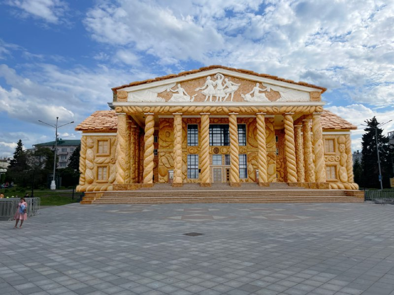

+++
title = ""
date = 2026-03-08T17:48:42+00:00
description = "Любая фотография города с современного смартфона с 2024 года — это не реальное фото. Это предсказание нейросети о том, как, по её мнению, этот момент должен был выглядеть. Она цензурирует реальность:…"

[taxonomies]
days = ["2026-03-08"]

[extra]
id = 1412
day = "2026-03-08"
tg_url = "https://t.me/vitaly_zdanevich_chan/1412"
og_image = "5298665767295909006_1233691761_456260750.jpg"
next_id = 1413
next_title = ""
next_body = "#webdesign\n#webgl\n#shopify"
prev_id = 1411
prev_title = ""
prev_body = "Теперь в Яндекс Карты можно добавлять собственные 3D-модели зданий и ориентиров: от памятников до узнаваемых домов в районе.\nАрхитекторы могут поделиться трёхмерными моделями своих реализованных проектов\nДумаю, можно ли будет потом экспортировать эти дома для сувенирной продукции?\nyandex.ru/project/maps/3d"
views = 15
forwarded_from = "Daniilak — Канал"
forwarded_from_url = "https://t.me/daniilak/1425"
ids = [1412]
+++

Любая фотография города с современного смартфона с 2024 года — это не реальное фото. Это предсказание нейросети о том, как, по её мнению, этот момент должен был выглядеть.  

Она цензурирует реальность: убирает шумы, которые были на самом деле. Добавляет детали в тенях, которых никто не видел. Усиливает цвета, которых не было. Она буквально дорисовывает мир за вас, руководствуясь статистикой миллионов чужих снимков.  

Вы получаете не фото города, а идеализированный цифровой призрак города, коллективный сон искусственного интеллекта о том, что такое «красивый городской кадр»  

**Вы не запечатлели реальность. Вы получили её AI-одобренную, откалиброванную для лайков, версию. Фотография в её классическом понимании мертва**

