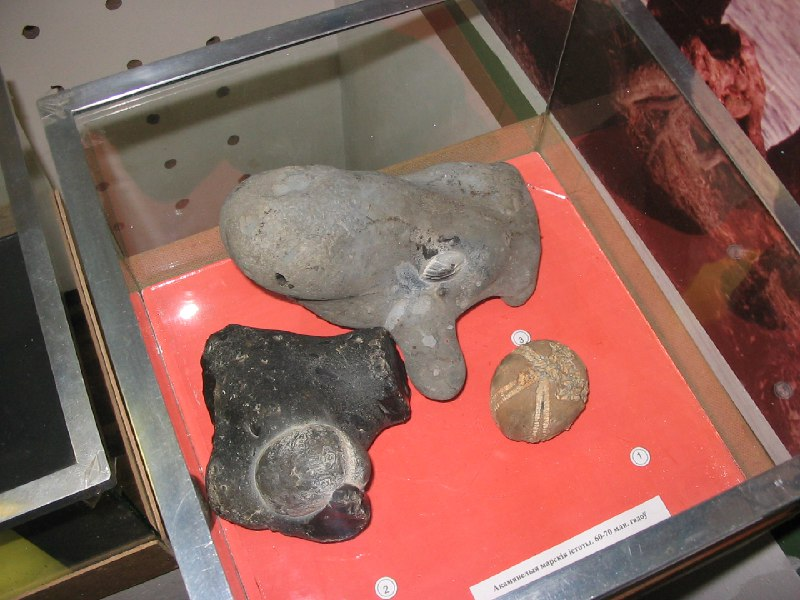

+++
title = ""
date = 2026-03-10T16:18:57+00:00
description = "stone animal museum belarus globustut year2005Source"

[taxonomies]
days = ["2026-03-10"]
tags = ["stone", "animal", "museum", "belarus", "globustut", "year_2005"]

[extra]
id = 1417
day = "2026-03-10"
tg_url = "https://t.me/vitaly_zdanevich_chan/1417"
og_image = "5296309385032309549_1233143123_460004141.jpg"
next_id = 1418
next_title = ""
prev_id = 1416
prev_title = ""
views = 13
ids = [1417]
+++

{{ tag(t="stone") }}  
{{ tag(t="animal") }}  
{{ tag(t="museum") }}  
{{ tag(t="belarus") }}  
{{ tag(t="globustut") }}  
{{ tag(t="year_2005") }}[Source](https://commons.wikimedia.org/wiki/File:055-292_%D0%9D%D0%BE%D0%B2%D0%BE%D0%B3%D1%80%D1%83%D0%B4%D0%BE%D0%BA,_%D0%B2_%D0%BA%D1%80%D0%B0%D0%B5%D0%B2%D0%B5%D0%B4%D1%87%D0%B5%D1%81%D0%BA%D0%BE%D0%BC_%D0%BC%D1%83%D0%B7%D0%B5%D0%B5,_%D1%81%D0%BD%D1%8F%D1%82%D0%BE_29_%D0%BC%D0%B0%D1%8F_2005.jpg)

