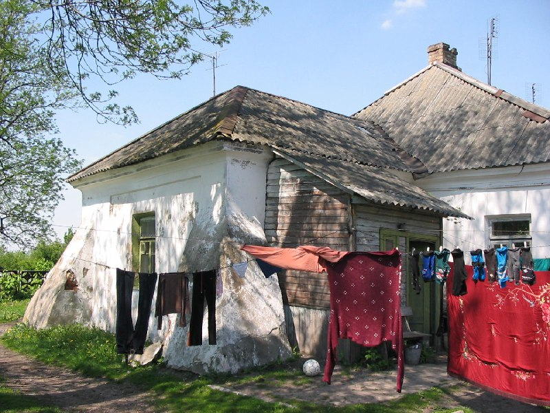

+++
title = ""
date = 2026-03-10T16:26:42+00:00
description = "architecture belarus globustut year2005 Source"

[taxonomies]
days = ["2026-03-10"]
tags = ["architecture", "belarus", "globustut", "year_2005"]

[extra]
id = 1419
day = "2026-03-10"
tg_url = "https://t.me/vitaly_zdanevich_chan/1419"
og_image = "5296309385032309577_1233143123_460004169.jpg"
next_id = 1420
next_title = ""
prev_id = 1418
prev_title = ""
views = 13
ids = [1419]
+++

{{ tag(t="architecture") }}
{{ tag(t="belarus") }}
{{ tag(t="globustut") }}
{{ tag(t="year_2005") }}

[Source](https://commons.wikimedia.org/wiki/File:055-332_%D0%9D%D0%BE%D0%B2%D0%BE%D0%B3%D1%80%D1%83%D0%B4%D0%BE%D0%BA,_%D0%BC%D0%BE%D0%BD%D0%B0%D1%81%D1%82%D1%8B%D1%80%D1%8C_%D0%B7%D0%B0_%D1%86%D0%B5%D1%80%D0%BA%D0%BE%D0%B2%D1%8C%D1%8E_%D0%91%D0%BE%D1%80%D0%B8%D1%81%D0%BE%D0%B3%D0%BB,_%D1%81%D0%BD%D1%8F%D1%82%D0%BE_29_%D0%BC%D0%B0%D1%8F_2005.jpg)

