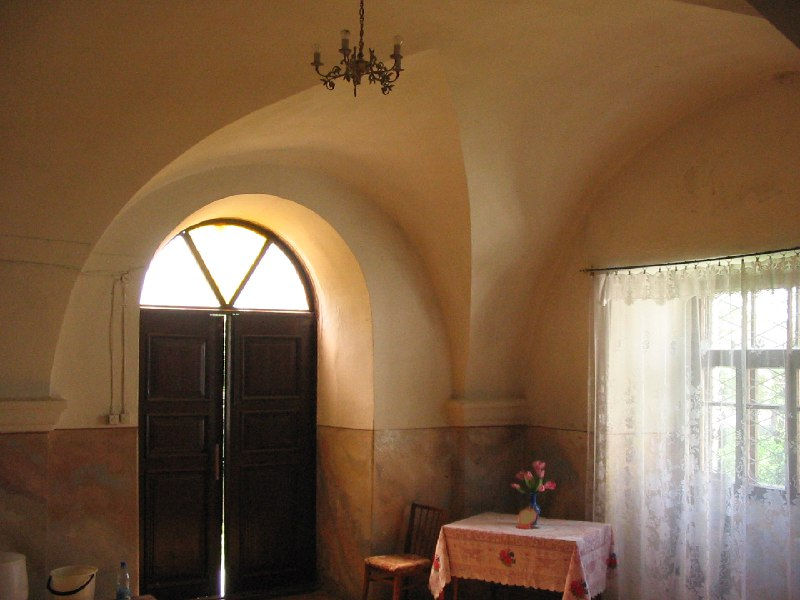

+++
title = ""
date = 2026-03-10T16:33:17+00:00
description = "church inside table lacecurtain doubledoor bucket belarus globustut year2005 Source,%D1%81%D0%BD%D1%8F%D1%82%D0%BE29%D0%BC%D0%B0%D1%8F2005.jpg)"

[taxonomies]
days = ["2026-03-10"]
tags = ["church", "inside", "table", "lace_curtain", "double_door", "bucket", "belarus", "globustut", "year_2005"]

[extra]
id = 1420
day = "2026-03-10"
tg_url = "https://t.me/vitaly_zdanevich_chan/1420"
og_image = "5296309385032309582_1233143123_460004174.jpg"
next_id = 1421
next_title = ""
prev_id = 1419
prev_title = ""
views = 14
ids = [1420]
+++

{{ tag(t="church") }}  
{{ tag(t="inside") }}  
{{ tag(t="table") }}  
{{ tag(t="lace_curtain") }}  
{{ tag(t="double_door") }}  
{{ tag(t="bucket") }}  
{{ tag(t="belarus") }}  
{{ tag(t="globustut") }}  
{{ tag(t="year_2005") }}  

[Source](https://commons.wikimedia.org/wiki/File:055-355_%D0%9D%D0%BE%D0%B2%D0%BE%D0%B3%D1%80%D1%83%D0%B4%D0%BE%D0%BA,_%D1%86%D0%B5%D1%80%D0%BA%D0%BE%D0%B2%D1%8C_%D0%91%D0%BE%D1%80%D0%B8%D1%81%D0%BE%D0%B3%D0%BB%D0%B5%D0%B1_(%D0%B2%D0%BD%D1%83%D1%82%D1%80%D0%B8),_%D1%81%D0%BD%D1%8F%D1%82%D0%BE_29_%D0%BC%D0%B0%D1%8F_2005.jpg)

