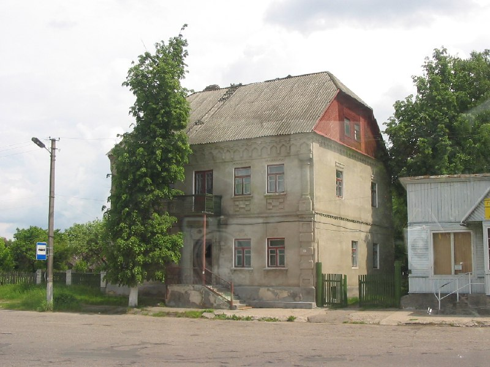
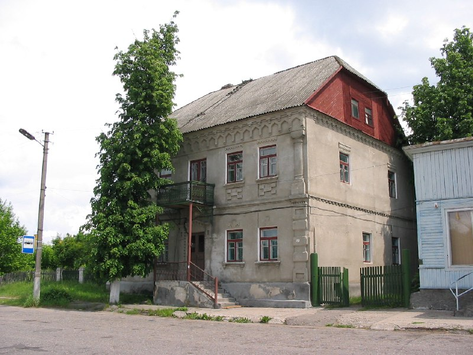

+++
title = "056-146 Слоним, дом напротив Андр костела, снято 5 июня 2005.jpg"
date = 2026-03-12T12:07:50+00:00
description = "056-146 Слоним, дом напротив Андр костела, снято 5 июня 2005.jpg architecture gray slonim belarus globustut year2005"

[taxonomies]
tags = ["architecture", "gray", "slonim", "belarus", "globustut", "year_2005"]

[extra]
tg_url = "https://t.me/vitaly_zdanevich_chan/1422"
og_image = "01.jpg"
next_id = 1424
next_title = "056-153 Слоним, снято 5 июня 2005.jpg"
prev_id = 1421
prev_title = "chatgpt jews"
views = 14
ids = [1422]
+++

[056-146 Слоним, дом напротив Андр костела, снято 5 июня 2005.jpg](https://commons.wikimedia.org/wiki/File:056-146_%D0%A1%D0%BB%D0%BE%D0%BD%D0%B8%D0%BC,_%D0%B4%D0%BE%D0%BC_%D0%BD%D0%B0%D0%BF%D1%80%D0%BE%D1%82%D0%B8%D0%B2_%D0%90%D0%BD%D0%B4%D1%80_%D0%BA%D0%BE%D1%81%D1%82%D0%B5%D0%BB%D0%B0,_%D1%81%D0%BD%D1%8F%D1%82%D0%BE_5_%D0%B8%D1%8E%D0%BD%D1%8F_2005.jpg)

{{ tag(t="architecture") }}
{{ tag(t="gray") }}
{{ tag(t="slonim") }}
{{ tag(t="belarus") }}
{{ tag(t="globustut") }}
{{ tag(t="year_2005") }}

