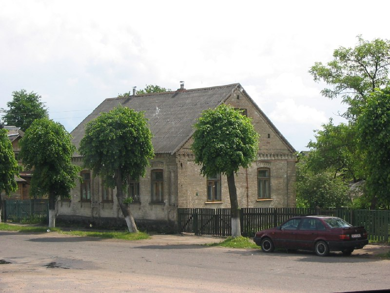

+++
title = ""
date = 2026-03-12T12:18:59+00:00
description = "building gray bricks slonim belarus year2005 Source,%D1%81%D0%BD%D1%8F%D1%82%D0%BE5%D0%B8%D1%8E%D0%BD%D1%8F2005.jpg)"

[taxonomies]
days = ["2026-03-12"]
tags = ["building", "gray", "bricks", "slonim", "belarus", "year_2005"]

[extra]
id = 1436
day = "2026-03-12"
tg_url = "https://t.me/vitaly_zdanevich_chan/1436"
og_image = "5301280942821414143_1234300654_460002559.jpg"
next_id = 1437
next_title = ""
next_body = "#building\n#bricks\n#village\n#white\n#slonim\n#belarus\n#globustut\n#year2005\nSource"
prev_id = 1426
prev_title = ""
prev_body = "#church\n#slonim\n#belarus\n#globustut\n#year2005\nSource"
views = 19
ids = [1436]
+++

{{ tag(t="building") }}  
{{ tag(t="gray") }}  
{{ tag(t="bricks") }}  
{{ tag(t="slonim") }}  
{{ tag(t="belarus") }}  
{{ tag(t="year_2005") }}  

[Source](https://commons.wikimedia.org/wiki/File:056-215_%D0%A1%D0%BB%D0%BE%D0%BD%D0%B8%D0%BC,_%D0%B4%D0%BE%D0%BC_(%D0%B8%D0%B7_%D0%B0%D0%B2%D1%82%D0%BE%D0%B1%D1%83%D1%81%D0%B0),_%D1%81%D0%BD%D1%8F%D1%82%D0%BE_5_%D0%B8%D1%8E%D0%BD%D1%8F_2005.jpg)

