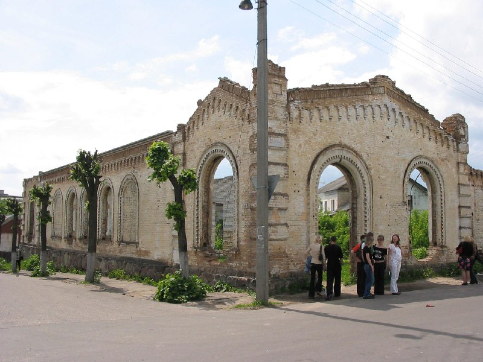

+++
title = "056-248 Слоним, снято 5 июня 2005.jpg"
date = 2026-03-15T23:48:40+00:00
description = "056-248 Слоним, снято 5 июня 2005.jpg abandone castle slonim belarus globustut year2005"

[taxonomies]
tags = ["abandone", "castle", "slonim", "belarus", "globustut", "year_2005"]

[extra]
tg_url = "https://t.me/vitaly_zdanevich_chan/1443"
og_image = "5312188123938757154_1236840180_460003874.jpg"
next_id = 1444
next_title = "056-283 Слоним, снято 5 июня 2005.jpg"
prev_id = 1439
prev_title = "webdesign animal cat"
views = 13
ids = [1443]
+++

[056-248 Слоним, снято 5 июня 2005.jpg](https://commons.wikimedia.org/wiki/File:056-248_%D0%A1%D0%BB%D0%BE%D0%BD%D0%B8%D0%BC,_%D1%81%D0%BD%D1%8F%D1%82%D0%BE_5_%D0%B8%D1%8E%D0%BD%D1%8F_2005.jpg)

{{ tag(t="abandone") }}
{{ tag(t="castle") }}
{{ tag(t="slonim") }}
{{ tag(t="belarus") }}
{{ tag(t="globustut") }}
{{ tag(t="year_2005") }}

