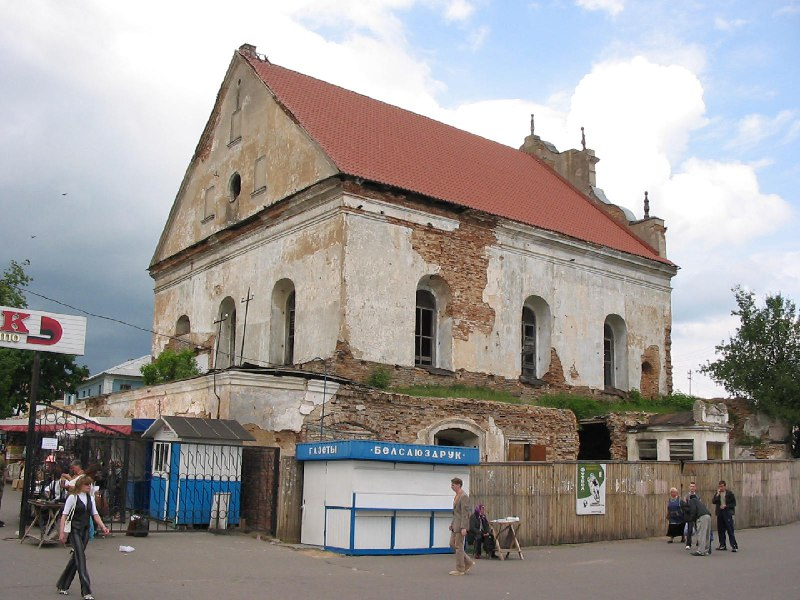
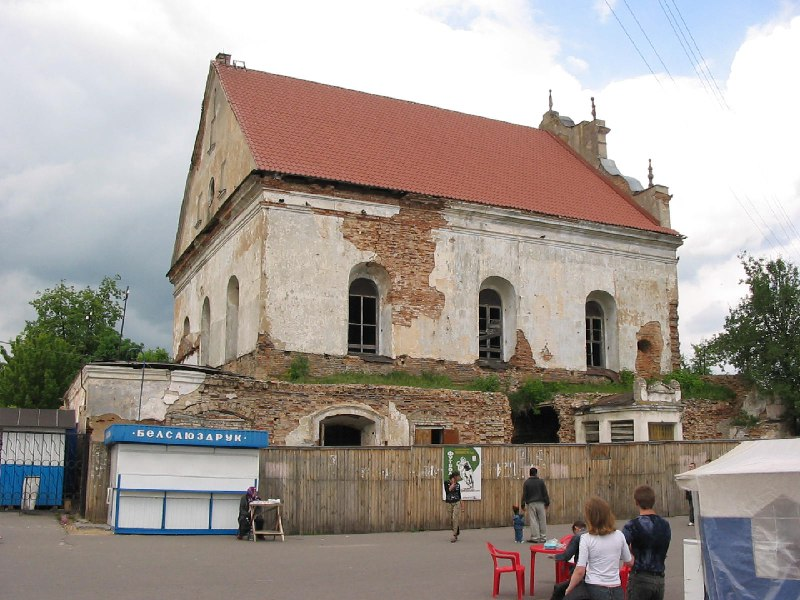
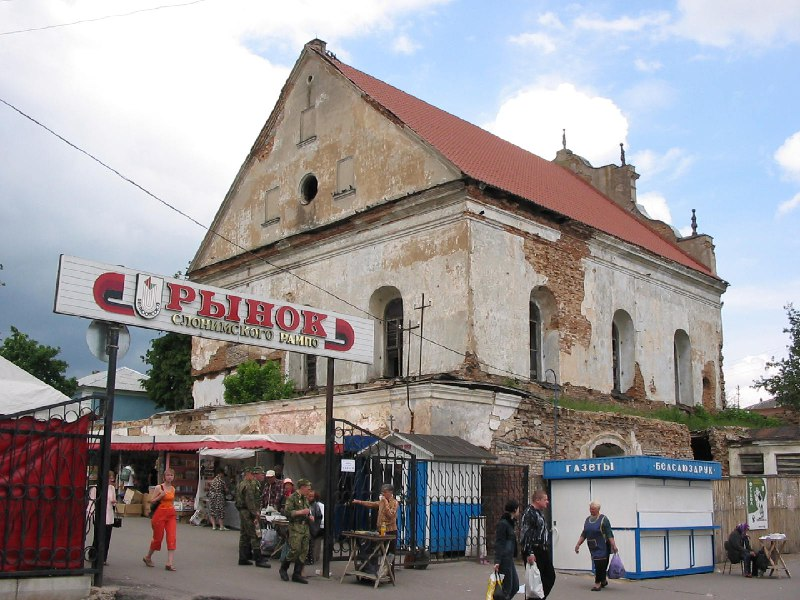
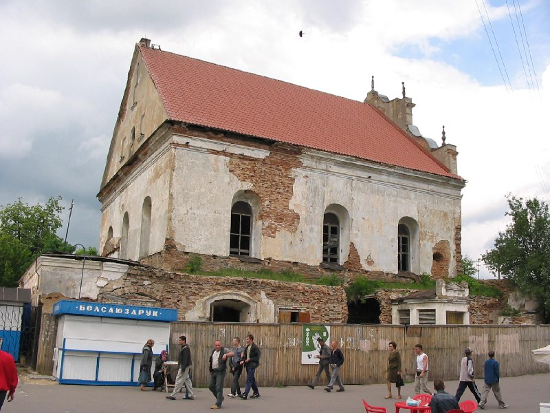
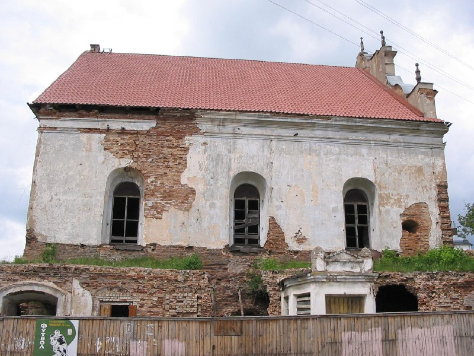
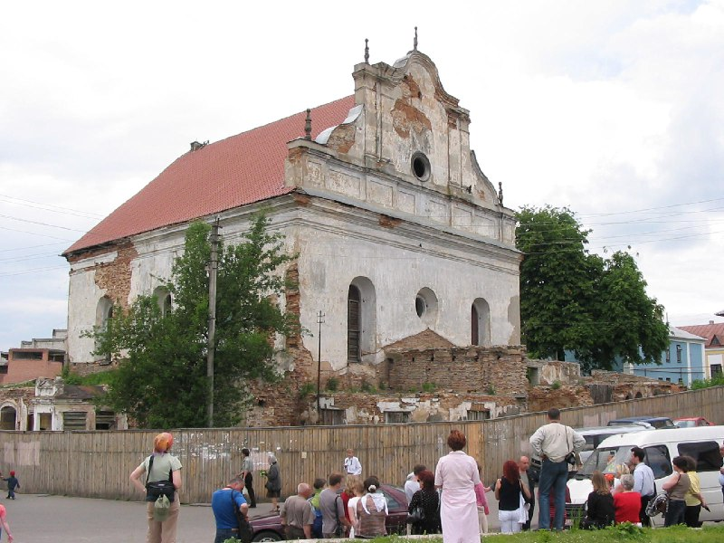
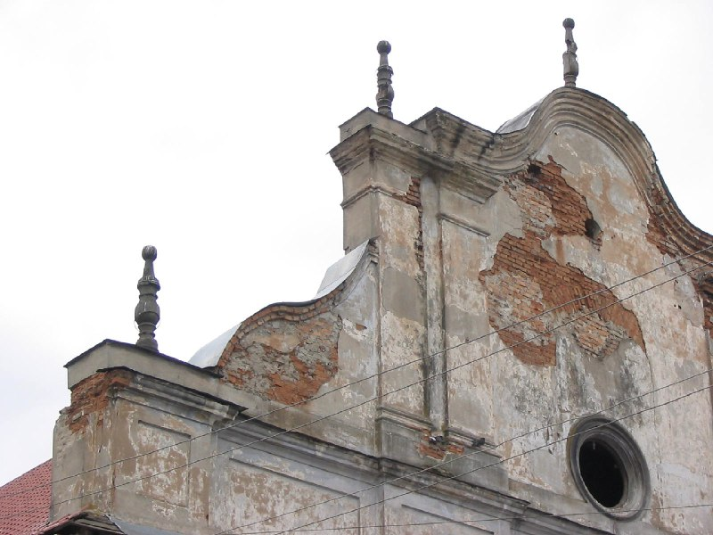
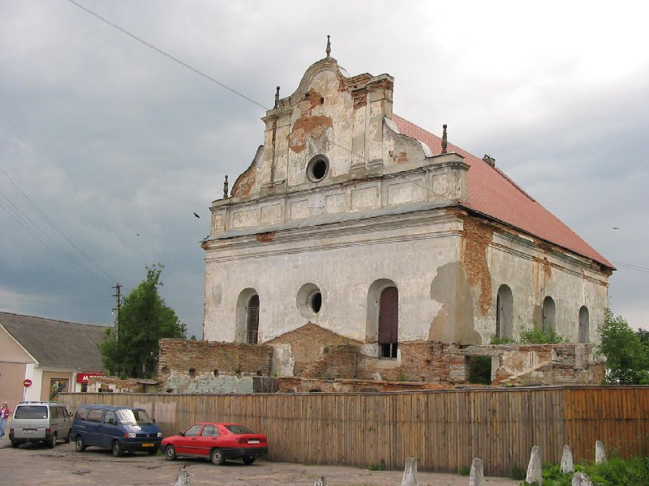

+++
title = ""
date = 2026-03-15T23:58:26+00:00
description = "abandone slonim belarus globustut year2005 Source"

[taxonomies]
days = ["2026-03-15"]
tags = ["abandone", "slonim", "belarus", "globustut", "year_2005"]

[extra]
id = 1450
day = "2026-03-15"
tg_url = "https://t.me/vitaly_zdanevich_chan/1450"
og_image = "01.jpg"
next_id = 1458
next_title = ""
next_body = "#church\n#outside\n#slonim\n#belarus\n#globustut\n#year2005\nSource"
prev_id = 1445
prev_title = ""
prev_body = "#architecture\n#orange\n#belarus\n#globustut\n#year2005\nSource"
views = 17
ids = [1450]
+++

{{ tag(t="abandone") }}  
{{ tag(t="slonim") }}  
{{ tag(t="belarus") }}  
{{ tag(t="globustut") }}  
{{ tag(t="year_2005") }}  

[Source](https://commons.wikimedia.org/wiki/File:056-327_%D0%A1%D0%BB%D0%BE%D0%BD%D0%B8%D0%BC,_%D1%81%D0%BD%D1%8F%D1%82%D0%BE_5_%D0%B8%D1%8E%D0%BD%D1%8F_2005.jpg)

