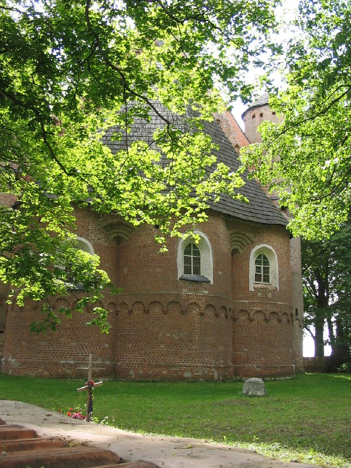
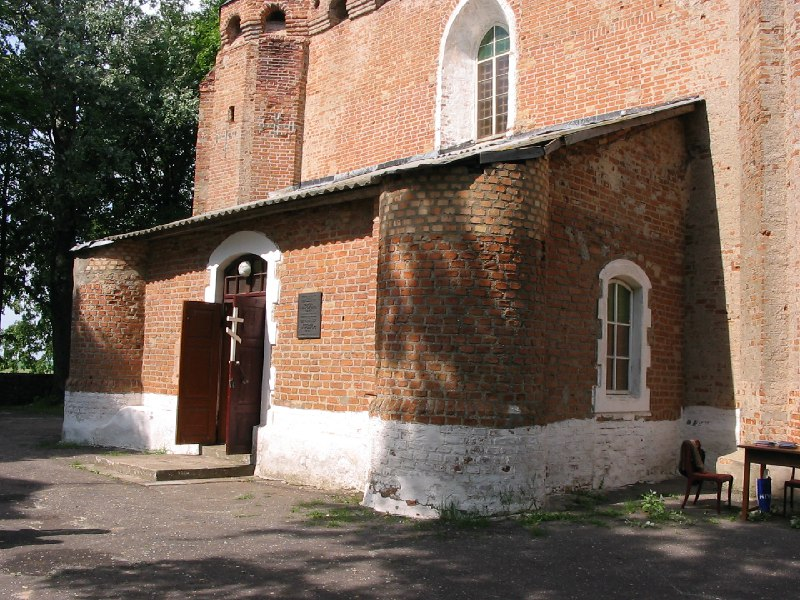

+++
title = ""
date = 2026-03-16T00:05:46+00:00
description = "church outside slonim belarus globustut year2005 Source"

[taxonomies]
days = ["2026-03-16"]
tags = ["church", "outside", "slonim", "belarus", "globustut", "year_2005"]

[extra]
id = 1458
day = "2026-03-16"
tg_url = "https://t.me/vitaly_zdanevich_chan/1458"
og_image = "01.jpg"
next_id = 1465
next_title = ""
prev_id = 1450
prev_title = ""
views = 17
ids = [1458]
+++

{{ tag(t="church") }}
{{ tag(t="outside") }}
{{ tag(t="slonim") }}
{{ tag(t="belarus") }}
{{ tag(t="globustut") }}
{{ tag(t="year_2005") }}

[Source](https://commons.wikimedia.org/wiki/File:056-419_%D0%A1%D1%8B%D0%BD%D0%BA%D0%BE%D0%B2%D0%B8%D1%87%D0%B8,_%D1%86%D0%B5%D1%80%D0%BA%D0%BE%D0%B2%D1%8C,_%D1%81%D0%BD%D1%8F%D1%82%D0%BE_5_%D0%B8%D1%8E%D0%BD%D1%8F_2005.jpg)

