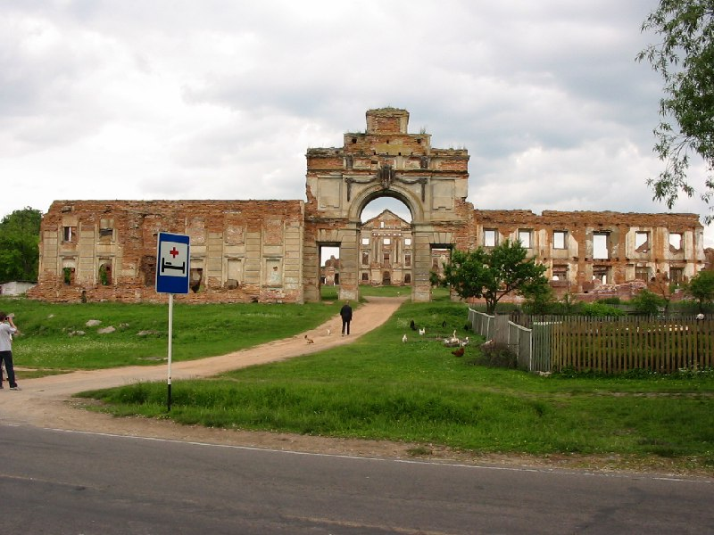
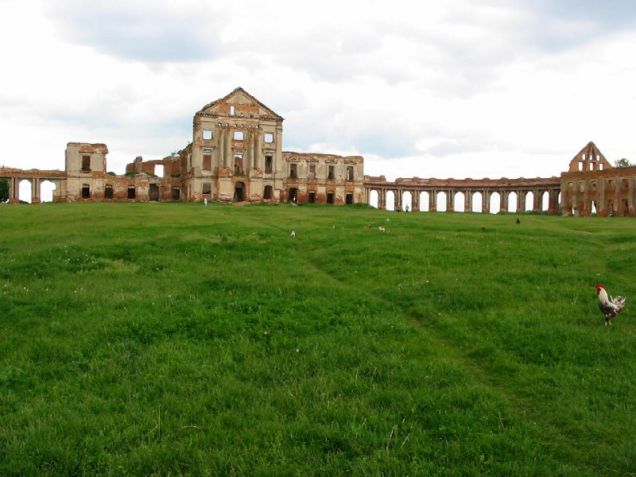
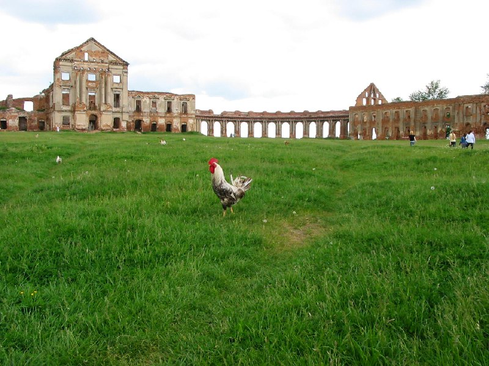
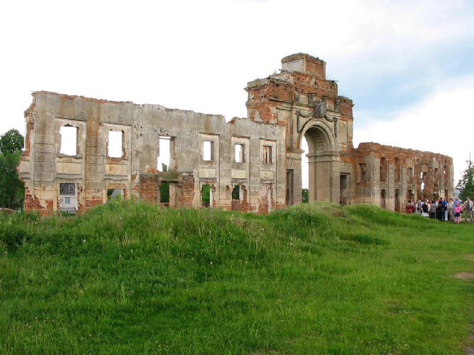

+++
title = ""
date = 2026-03-16T00:08:15+00:00
description = "ружаны abandone belarus globustut year2005 Source"

[taxonomies]
days = ["2026-03-16"]
tags = ["ружаны", "abandone", "belarus", "globustut", "year_2005"]

[extra]
id = 1465
day = "2026-03-16"
tg_url = "https://t.me/vitaly_zdanevich_chan/1465"
og_image = "01.jpg"
next_id = 1475
next_title = ""
prev_id = 1458
prev_title = ""
views = 21
ids = [1465]
+++

{{ tag(t="ружаны") }}  
{{ tag(t="abandone") }}  
{{ tag(t="belarus") }}  
{{ tag(t="globustut") }}  
{{ tag(t="year_2005") }}  

[Source](https://commons.wikimedia.org/wiki/File:056-477_%D0%A0%D1%83%D0%B6%D0%B0%D0%BD%D1%8B,_%D0%B4%D0%B2%D0%BE%D1%80%D0%B5%D1%86,_%D1%81%D0%BD%D1%8F%D1%82%D0%BE_5_%D0%B8%D1%8E%D0%BD%D1%8F_2005.jpg)

