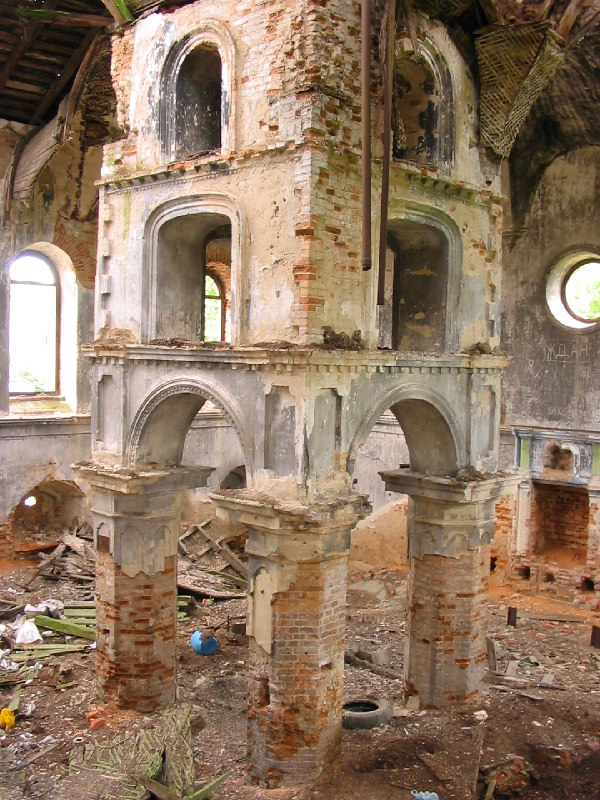
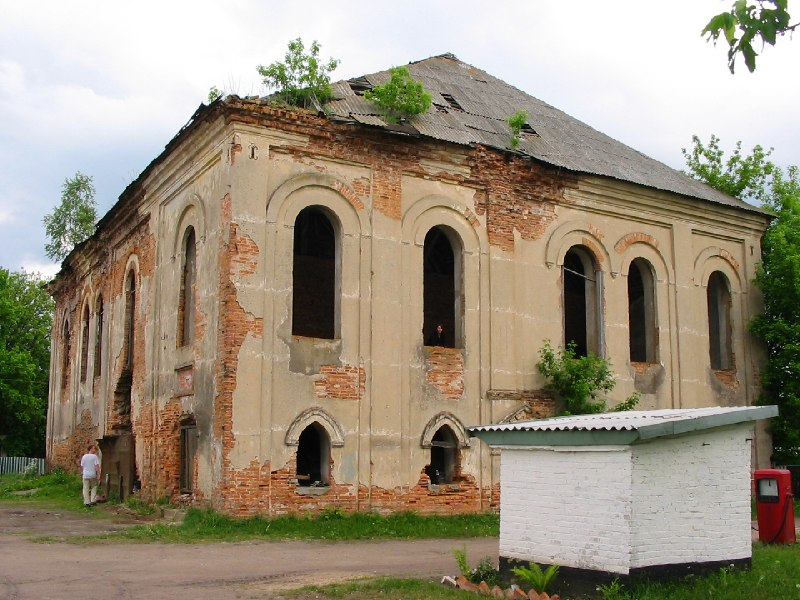
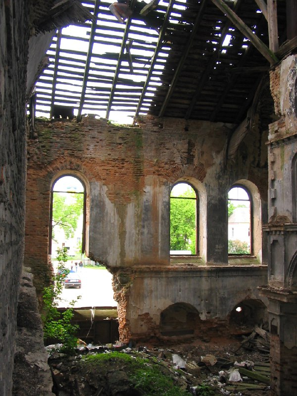
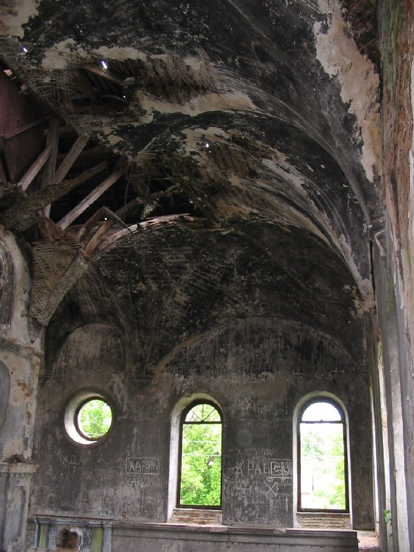
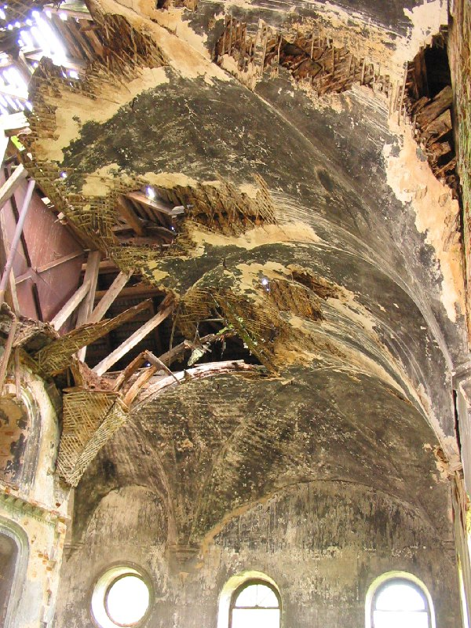
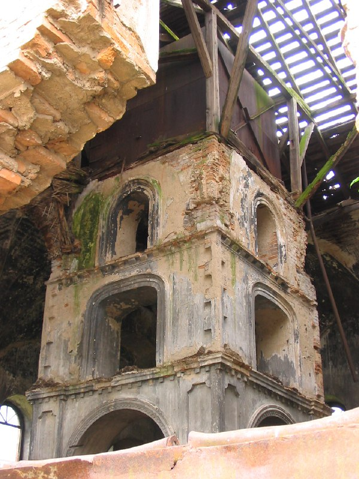

+++
title = "056-597 Ружаны, синагога ꞋꞋ18вꞋꞋ (внутри), снято 5 июня 2005.jpg"
date = 2026-03-16T00:12:51+00:00
description = "056-597 Ружаны, синагога ꞋꞋ18вꞋꞋ (внутри), снято 5 июня 2005.jpg abandone belarus globustut"

[taxonomies]
tags = ["abandone", "belarus", "globustut", "year_2005"]

[extra]
tg_url = "https://t.me/vitaly_zdanevich_chan/1475"
og_image = "01.jpg"
next_id = 1481
next_title = "056-681 Коссово, дворец, снято 5 июня 2005.jpg"
prev_id = 1465
prev_title = "056-477 Ружаны, дворец, снято 5 июня 2005.jpg"
views = 23
ids = [1475]
+++

[056-597 Ружаны, синагога ꞋꞋ18вꞋꞋ (внутри), снято 5 июня 2005.jpg](https://commons.wikimedia.org/wiki/File:056-597_%D0%A0%D1%83%D0%B6%D0%B0%D0%BD%D1%8B,_%D1%81%D0%B8%D0%BD%D0%B0%D0%B3%D0%BE%D0%B3%D0%B0_%EA%9E%8B%EA%9E%8B18%D0%B2%EA%9E%8B%EA%9E%8B_%28%D0%B2%D0%BD%D1%83%D1%82%D1%80%D0%B8%29,_%D1%81%D0%BD%D1%8F%D1%82%D0%BE_5_%D0%B8%D1%8E%D0%BD%D1%8F_2005.jpg)

{{ tag(t="abandone") }}
{{ tag(t="belarus") }}
{{ tag(t="globustut") }}

