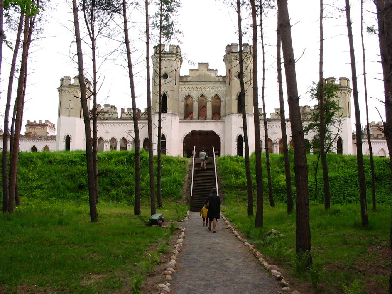
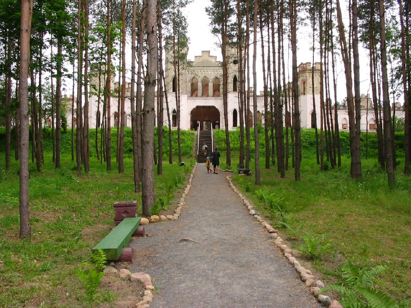
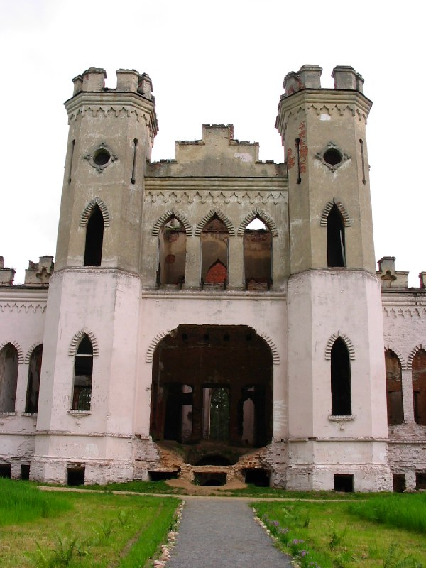
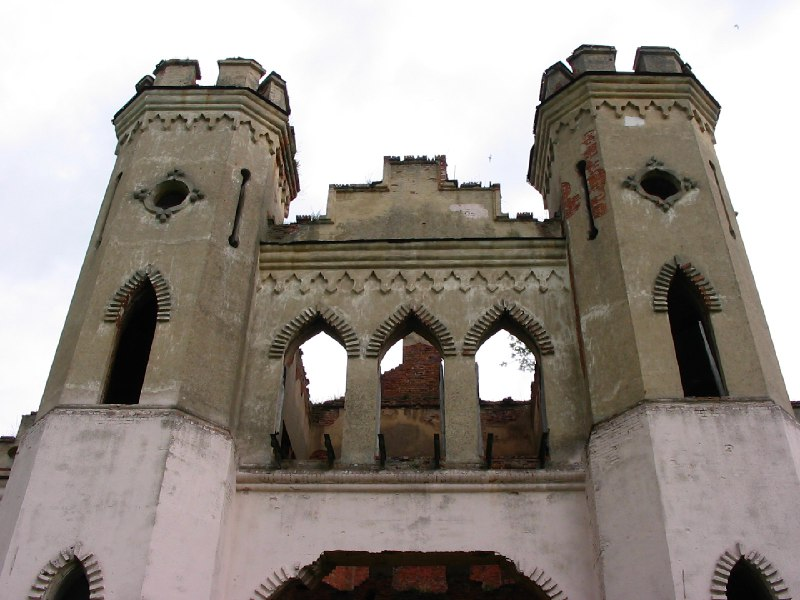
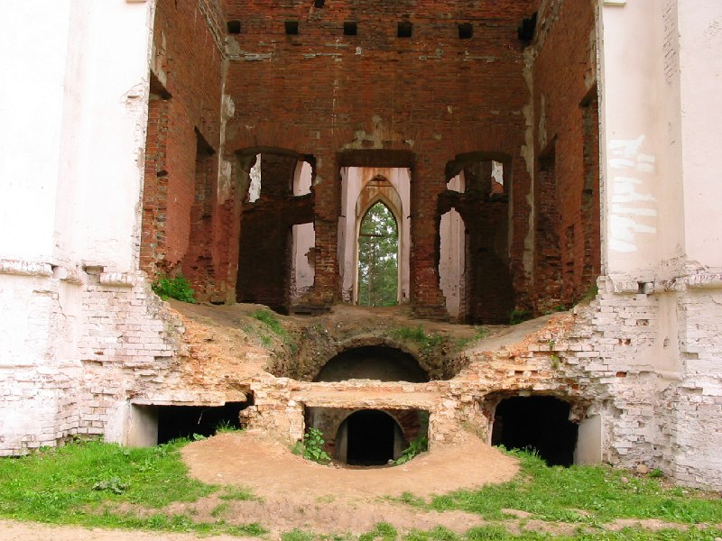
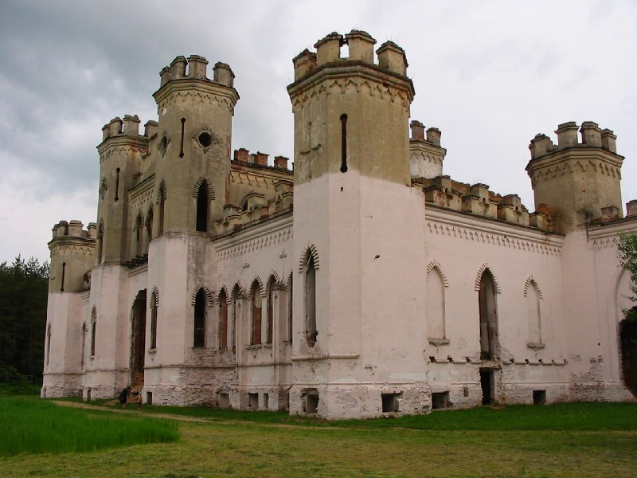
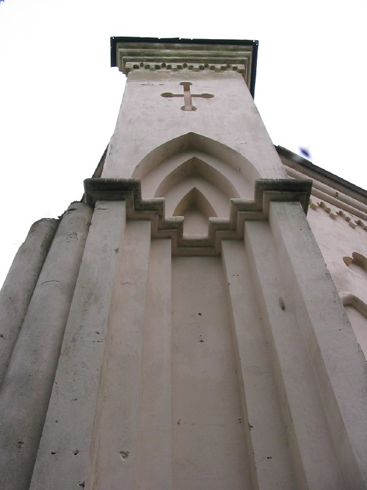
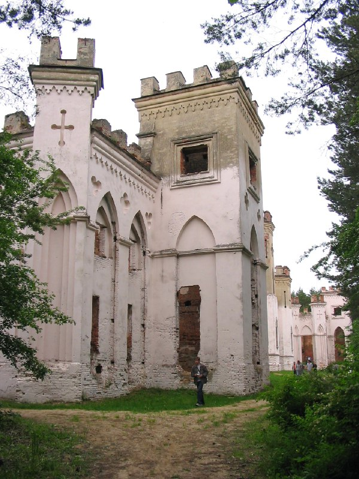
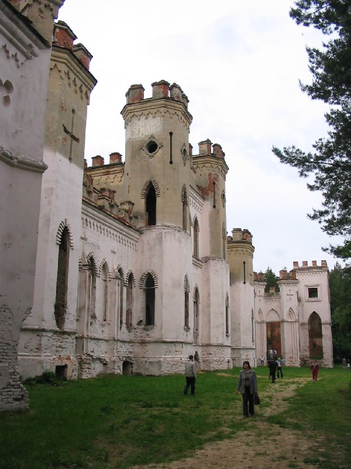
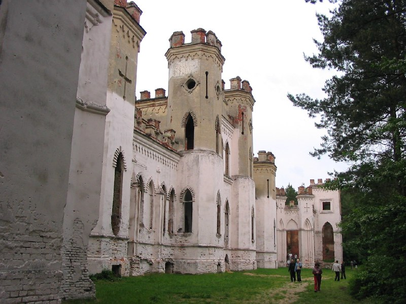

+++
title = "056-681 Коссово, дворец, снято 5 июня 2005.jpg"
date = 2026-03-16T00:14:42+00:00
description = "056-681 Коссово, дворец, снято 5 июня 2005.jpg castle коссово belarus globustut"

[taxonomies]
tags = ["castle", "коссово", "belarus", "globustut", "year_2005"]

[extra]
tg_url = "https://t.me/vitaly_zdanevich_chan/1481"
og_image = "01.jpg"
next_id = 1491
next_title = "telegram added a feature request"
prev_id = 1475
prev_title = "056-597 Ружаны, синагога ꞋꞋ18вꞋꞋ (внутри), снято 5 июня 2005.jpg"
views = 27
ids = [1481]
+++

[056-681 Коссово, дворец, снято 5 июня 2005.jpg](https://commons.wikimedia.org/wiki/File:056-681_%D0%9A%D0%BE%D1%81%D1%81%D0%BE%D0%B2%D0%BE,_%D0%B4%D0%B2%D0%BE%D1%80%D0%B5%D1%86,_%D1%81%D0%BD%D1%8F%D1%82%D0%BE_5_%D0%B8%D1%8E%D0%BD%D1%8F_2005.jpg)

{{ tag(t="castle") }}
{{ tag(t="коссово") }}
{{ tag(t="belarus") }}
{{ tag(t="globustut") }}

