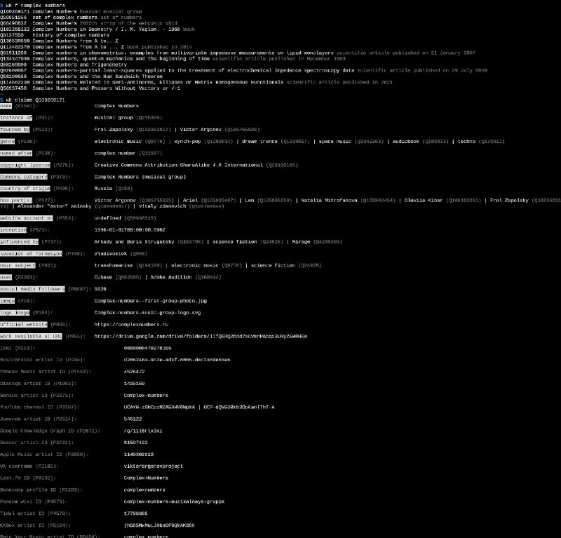

+++
title = "wow wikibase/wikidata in cli"
date = 2026-03-20T00:45:28+00:00
description = "wow wikibase/wikidata in cli"

[taxonomies]
tags = ["wikibase", "wikidata", "cli"]

[extra]
tg_url = "https://t.me/vitaly_zdanevich_chan/1493"
og_image = "5325703114708947786_1239986884_460002122.jpg"
next_id = 1494
next_title = "steam: almost 25% is on linux?"
prev_id = 1492
prev_title = "Isari 1907 N213-.pdf"
views = 21
ids = [1493]
+++

wow {{ tag(t="wikibase") }}/{{ tag(t="wikidata") }} in {{ tag(t="cli") }}

<https://github.com/maxlath/wikibase-cli/>

