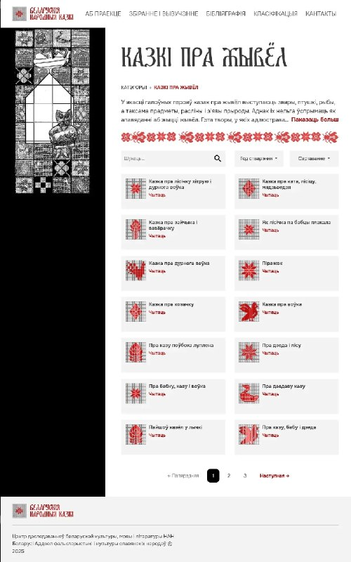

+++
title = ""
date = 2026-03-22T02:46:05+00:00
description = "webdesign belarus belarussian"

[taxonomies]
days = ["2026-03-22"]
tags = ["webdesign", "belarus", "belarussian"]

[extra]
id = 1496
day = "2026-03-22"
tg_url = "https://t.me/vitaly_zdanevich_chan/1496"
og_image = "5332599354717573599_1241592540_460001759.jpg"
next_id = 1497
next_title = ""
next_body = "#webdesign\n#bag\n#girl\n#pain\n#thorns\n#poppy\n#disagree"
prev_id = 1494
prev_title = ""
prev_body = "#steam: almost 25% is on #linux?"
views = 20
ids = [1496]
+++

{{ tag(t="webdesign") }}  
{{ tag(t="belarus") }}  
{{ tag(t="belarussian") }}  

<https://bnkorpus.info/kazki/classification/%D0%9A%D0%B0%D0%B7%D0%BA%D1%96%20%D0%BF%D1%80%D0%B0%20%D0%B6%D1%8B%D0%B2%D1%91%D0%BB>

