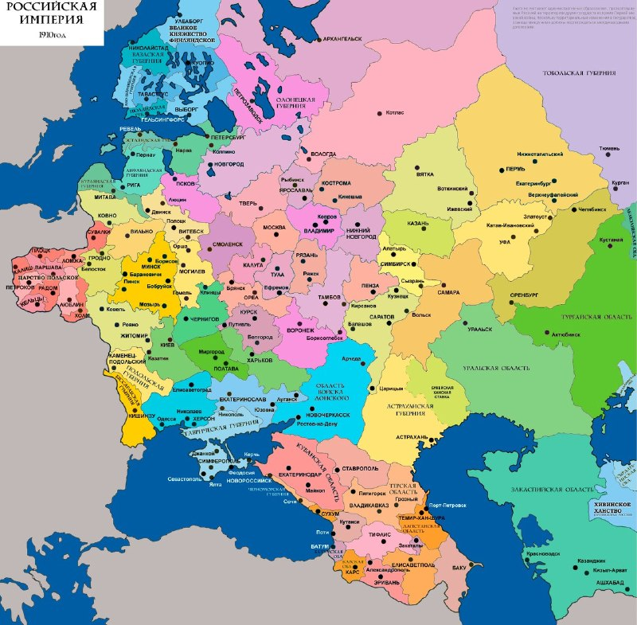

+++
title = ""
date = 2026-03-24T03:24:00+00:00
description = "map russia russianempire blacksea sakartvelo year1910"

[taxonomies]
days = ["2026-03-24"]
tags = ["map", "russia", "russian_empire", "black_sea", "sakartvelo", "year_1910"]

[extra]
id = 1502
day = "2026-03-24"
tg_url = "https://t.me/vitaly_zdanevich_chan/1502"
og_image = "5336893059293188649_1242592246_460001833.jpg"
next_id = 1503
next_title = ""
prev_id = 1501
prev_title = ""
views = 19
ids = [1502]
+++

{{ tag(t="map") }}  
{{ tag(t="russia") }}  
{{ tag(t="russian_empire") }}  
{{ tag(t="black_sea") }}  
{{ tag(t="sakartvelo") }}  
{{ tag(t="year_1910") }}  

<https://commons.wikimedia.org/wiki/File:Evropayskye_gubernii_Rossii_1910.png>

