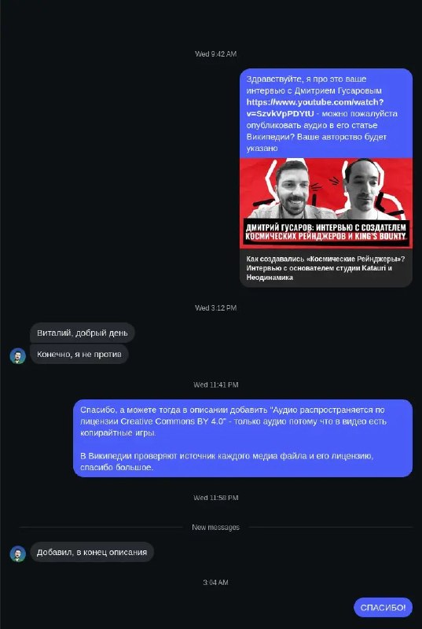

+++
title = ""
date = 2026-03-25T23:05:52+00:00
description = "wikipedia wikimediacommons Пишите авторам контентов - иногда они соглашаются сделать его Creative Commons"

[taxonomies]
days = ["2026-03-25"]
tags = ["wikipedia", "wikimedia_commons"]

[extra]
id = 1503
day = "2026-03-25"
tg_url = "https://t.me/vitaly_zdanevich_chan/1503"
og_image = "5341786066425420454_1243731488_460004006.jpg"
next_id = 1504
next_title = ""
next_body = "#darkmode"
prev_id = 1502
prev_title = ""
prev_body = "#map\n#russia\n#russianempire\n#blacksea\n#sakartvelo\n#year1910"
views = 18
ids = [1503]
+++

{{ tag(t="wikipedia") }}  
{{ tag(t="wikimedia_commons") }}  

Пишите авторам контентов - иногда они соглашаются сделать его Creative Commons  

<https://www.youtube.com/watch?v=SzvkVpPDYtU>

{{ youtube(id="SzvkVpPDYtU") }}

