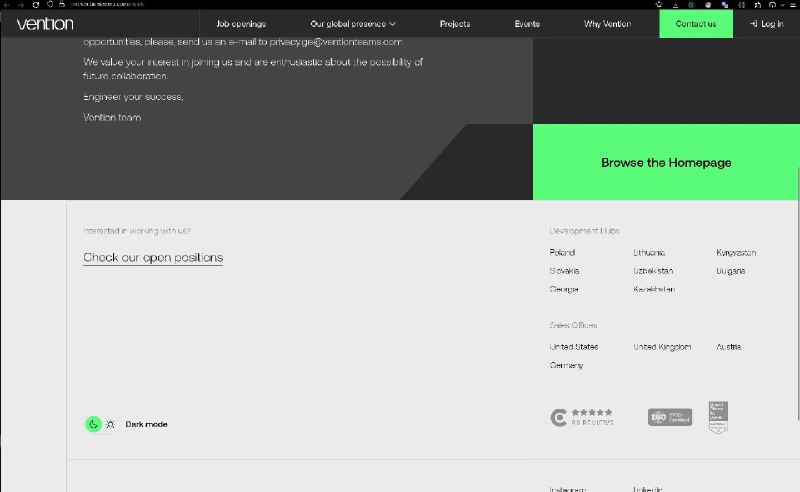
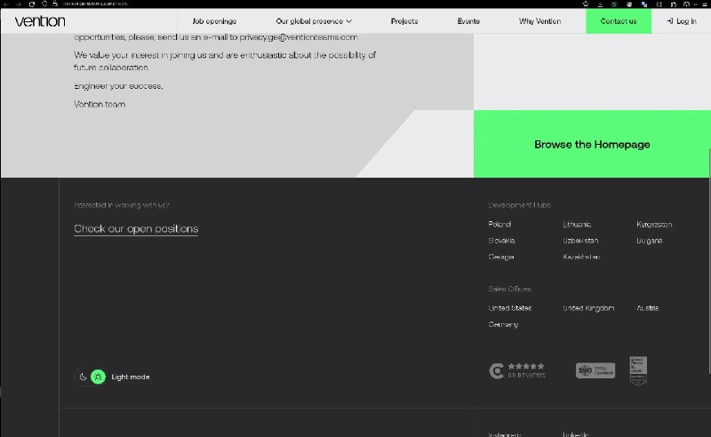

+++
title = ""
date = 2026-03-28T02:41:03+00:00
description = "darkmode"

[taxonomies]
days = ["2026-03-28"]
tags = ["dark_mode"]

[extra]
id = 1504
day = "2026-03-28"
tg_url = "https://t.me/vitaly_zdanevich_chan/1504"
og_image = "01.jpg"
next_id = 1506
next_title = ""
next_body = "#shutdown\n#cloudflare\n#preservation\n#school\n#error\nЧто вы будете делать когда вот это всё отключат по всему миру?\nЧто ты будешь делать без этой подсказки?"
prev_id = 1503
prev_title = ""
prev_body = "#wikipedia\n#wikimediacommons\nПишите авторам контентов - иногда они соглашаются сделать его Creative Commons"
views = 14
ids = [1504]
+++

{{ tag(t="dark_mode") }}  

<https://join.ventionteams.com/thank>

