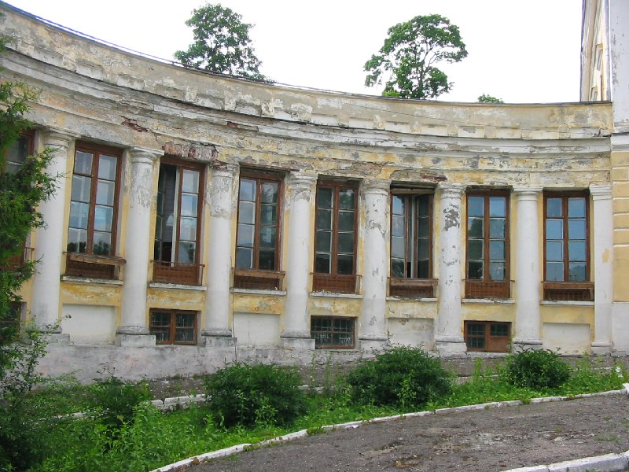
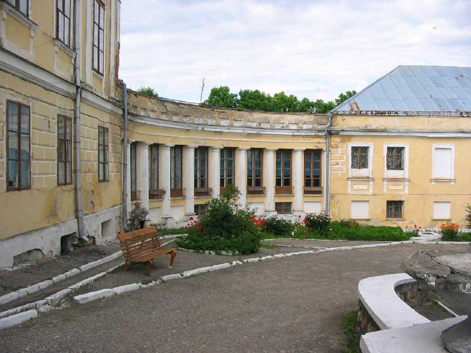
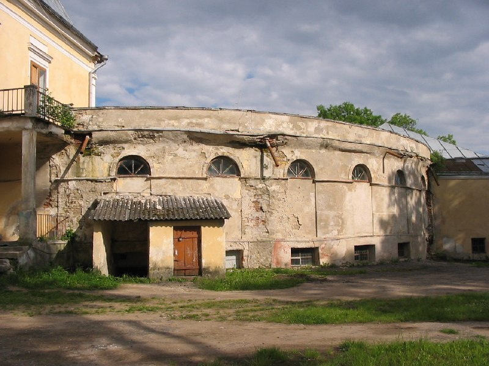
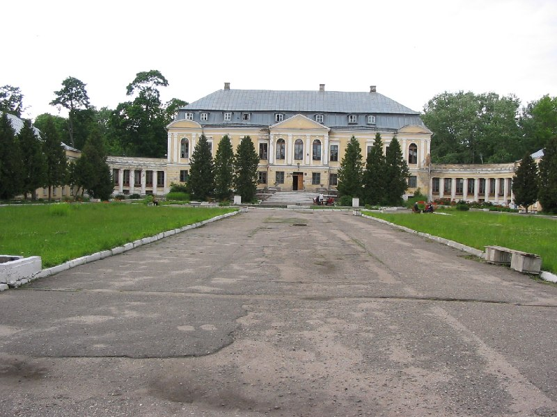
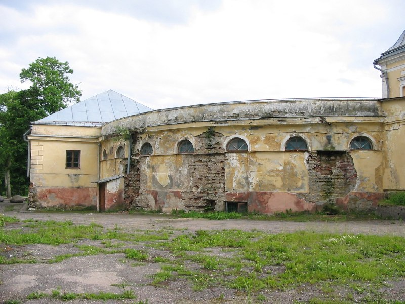
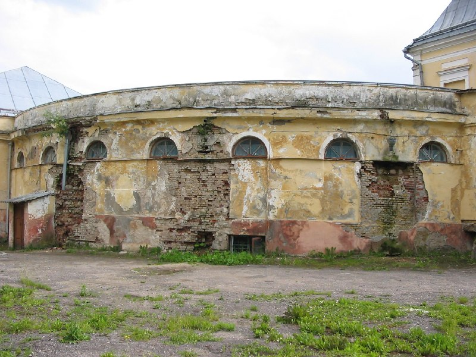

+++
title = ""
date = 2026-03-29T04:17:29+00:00
description = "abandone columns святск belarus globustut year2005Source"

[taxonomies]
days = ["2026-03-29"]
tags = ["abandone", "columns", "святск", "belarus", "globustut", "year_2005"]

[extra]
id = 1511
day = "2026-03-29"
tg_url = "https://t.me/vitaly_zdanevich_chan/1511"
og_image = "01.jpg"
next_id = 1517
next_title = ""
prev_id = 1509
prev_title = ""
views = 14
ids = [1511]
+++

{{ tag(t="abandone") }}
{{ tag(t="columns") }}
{{ tag(t="святск") }}
{{ tag(t="belarus") }}
{{ tag(t="globustut") }}
{{ tag(t="year_2005") }}[Source](https://commons.wikimedia.org/wiki/File:057-258_%D0%A1%D0%B2%D1%8F%D1%82%D1%81%D0%BA,_%D1%81%D0%BD%D1%8F%D1%82%D0%BE_12_%D0%B8%D1%8E%D0%BD%D1%8F_2005.jpg)

