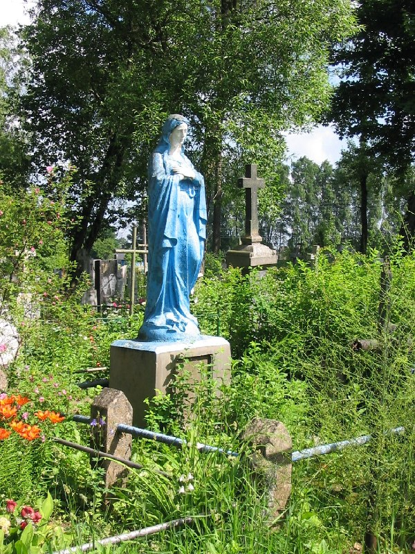

+++
title = "059-040 Ивашковцы, снято 19 июня 2005.jpg"
date = 2026-03-29T12:56:46+00:00
description = "059-040 Ивашковцы, снято 19 июня 2005.jpg cementery virginmary blue monument belarus ивашковцы globustut year2005"

[taxonomies]
tags = ["cementery", "virgin_mary", "blue", "monument", "belarus", "ивашковцы", "globustut", "year_2005"]

[extra]
tg_url = "https://t.me/vitaly_zdanevich_chan/1521"
og_image = "5353089436800979966_1246363259_460002302.jpg"
next_id = 1522
next_title = "059-111 Пелегринда, усыпальница, снято 19 июня 2005.jpg"
prev_id = 1517
prev_title = "057-561 Лойки, снято 12 июня 2005.jpg"
views = 15
ids = [1521]
+++

[059-040 Ивашковцы, снято 19 июня 2005.jpg](https://commons.wikimedia.org/wiki/File:059-040_%D0%98%D0%B2%D0%B0%D1%88%D0%BA%D0%BE%D0%B2%D1%86%D1%8B,_%D1%81%D0%BD%D1%8F%D1%82%D0%BE_19_%D0%B8%D1%8E%D0%BD%D1%8F_2005.jpg)

{{ tag(t="cementery") }}
{{ tag(t="virgin_mary") }}
{{ tag(t="blue") }}
{{ tag(t="monument") }}
{{ tag(t="belarus") }}
{{ tag(t="ивашковцы") }}
{{ tag(t="globustut") }}
{{ tag(t="year_2005") }}

