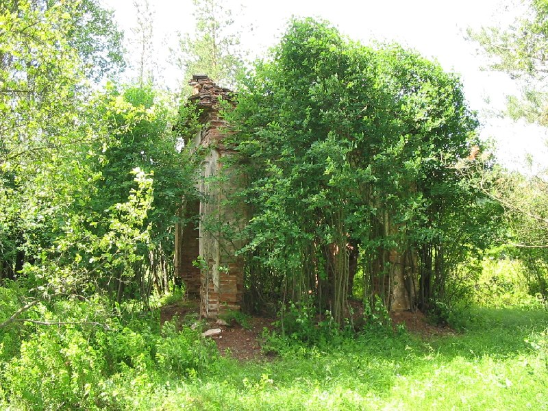
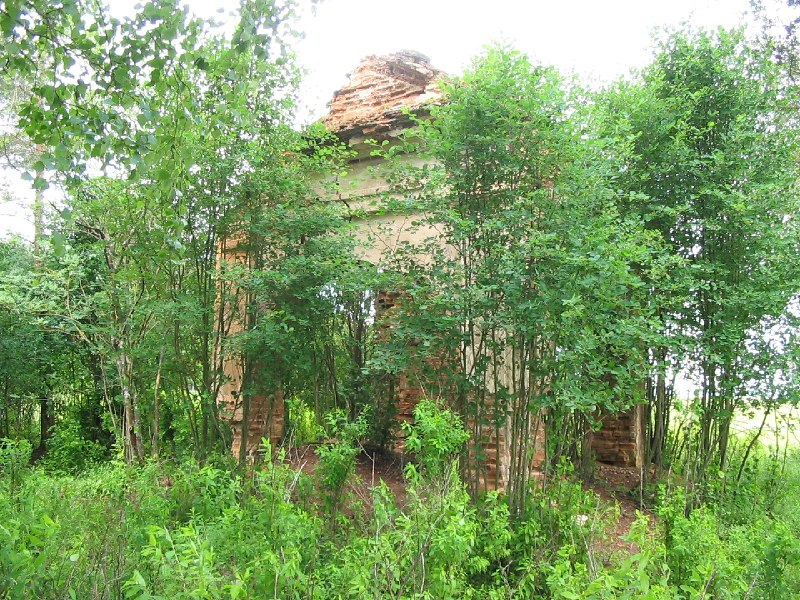
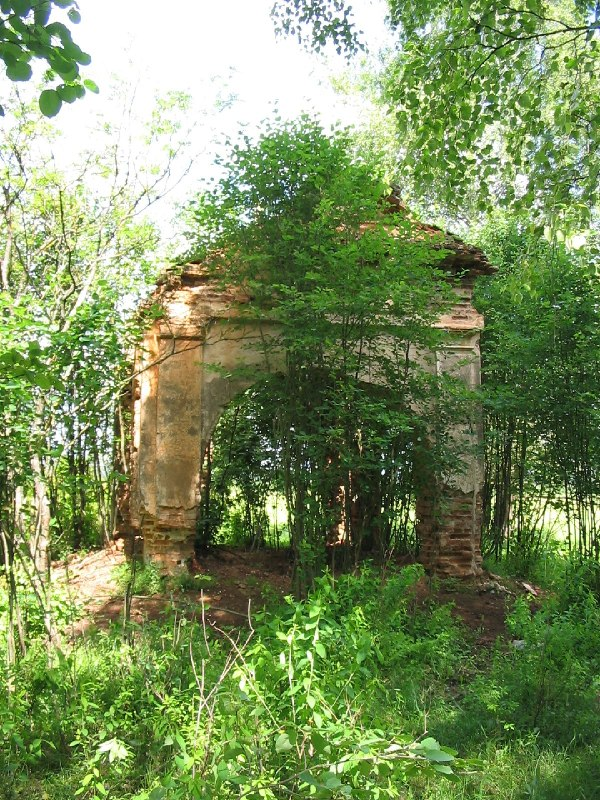
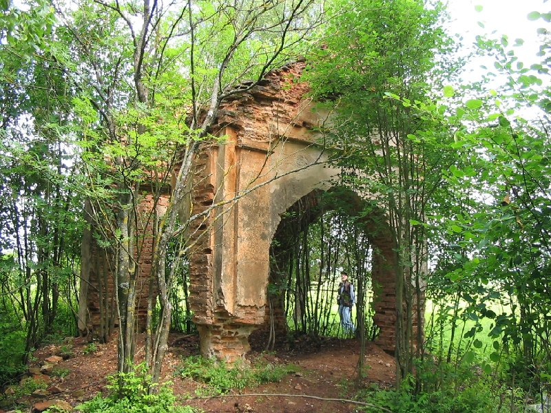
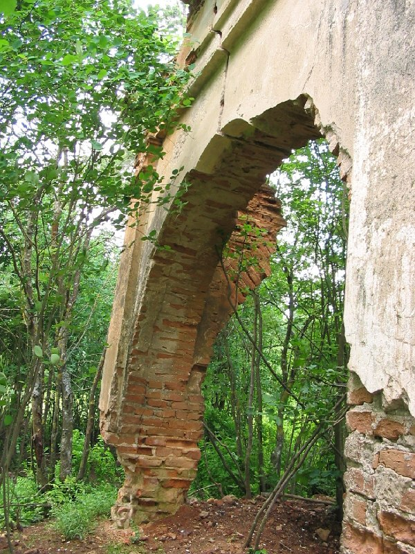
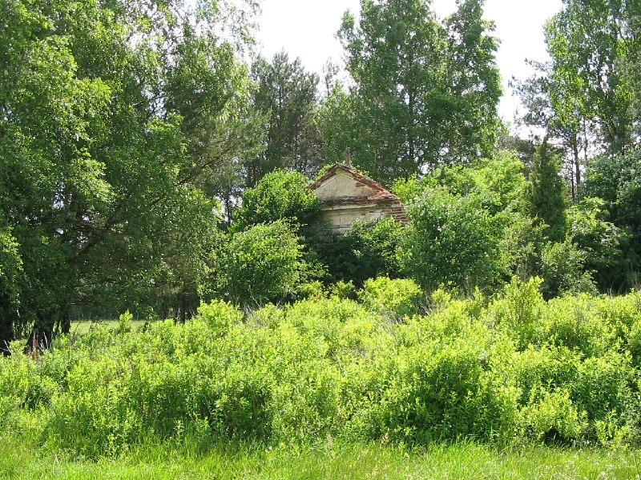

+++
title = ""
date = 2026-03-29T13:03:00+00:00
description = "abandone belarus Пелегринда globustut year2005 Source"

[taxonomies]
days = ["2026-03-29"]
tags = ["abandone", "belarus", "Пелегринда", "globustut", "year_2005"]

[extra]
id = 1522
day = "2026-03-29"
tg_url = "https://t.me/vitaly_zdanevich_chan/1522"
og_image = "01.jpg"
next_id = 1529
next_title = ""
next_body = "#village\n#black\n#abandone\n#Пелегринда\n#belarus\n#globustut\n#year2005\nSource"
prev_id = 1521
prev_title = ""
prev_body = "#cementery\n#virginmary\n#blue\n#monument\n#belarus\n#ивашковцы\n#globustut\n#year2005\nSource"
views = 16
ids = [1522]
+++

{{ tag(t="abandone") }}  
{{ tag(t="belarus") }}  
{{ tag(t="Пелегринда") }}  
{{ tag(t="globustut") }}  
{{ tag(t="year_2005") }}

[Source](https://commons.wikimedia.org/wiki/File:059-111_%D0%9F%D0%B5%D0%BB%D0%B5%D0%B3%D1%80%D0%B8%D0%BD%D0%B4%D0%B0,_%D1%83%D1%81%D1%8B%D0%BF%D0%B0%D0%BB%D1%8C%D0%BD%D0%B8%D1%86%D0%B0,_%D1%81%D0%BD%D1%8F%D1%82%D0%BE_19_%D0%B8%D1%8E%D0%BD%D1%8F_2005.jpg)

