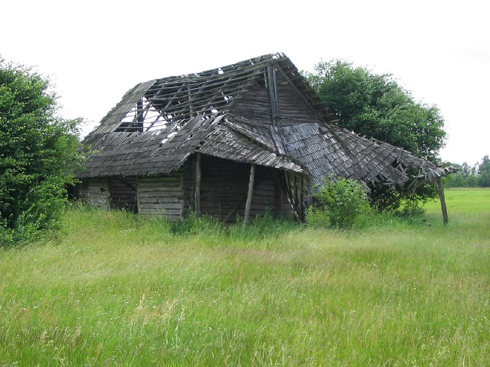
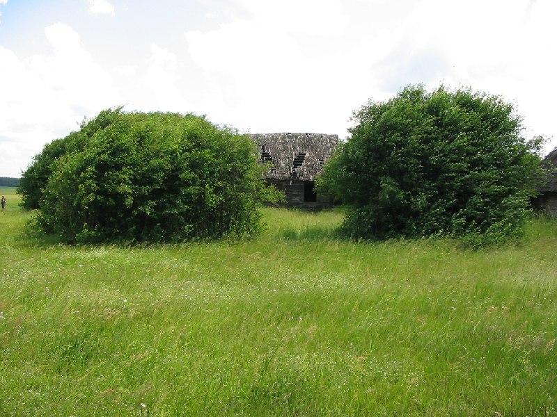

+++
title = ""
date = 2026-03-29T13:04:14+00:00
description = "village black abandone Пелегринда belarus globustut year2005Source"

[taxonomies]
days = ["2026-03-29"]
tags = ["village", "black", "abandone", "Пелегринда", "belarus", "globustut", "year_2005"]

[extra]
id = 1529
day = "2026-03-29"
tg_url = "https://t.me/vitaly_zdanevich_chan/1529"
og_image = "01.jpg"
next_id = 1531
next_title = ""
prev_id = 1522
prev_title = ""
views = 17
ids = [1529]
+++

{{ tag(t="village") }}
{{ tag(t="black") }}
{{ tag(t="abandone") }}
{{ tag(t="Пелегринда") }}
{{ tag(t="belarus") }}
{{ tag(t="globustut") }}
{{ tag(t="year_2005") }}[Source](https://commons.wikimedia.org/wiki/File:059-126_%D0%9F%D0%B5%D0%BB%D0%B5%D0%B3%D1%80%D0%B8%D0%BD%D0%B4%D0%B0,_%D1%81%D0%BD%D1%8F%D1%82%D0%BE_19_%D0%B8%D1%8E%D0%BD%D1%8F_2005.jpg)

