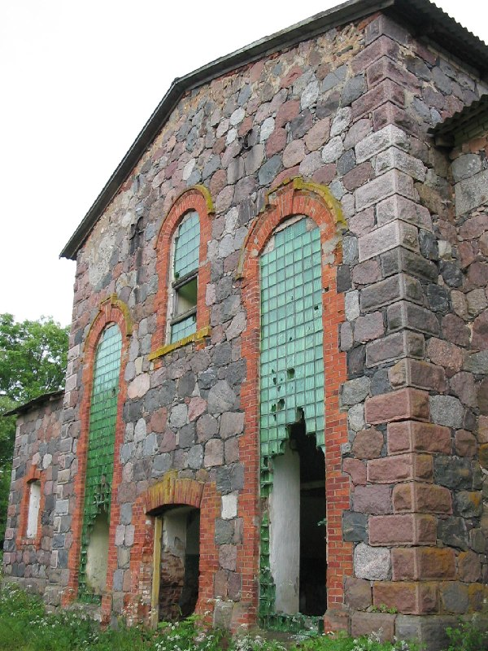
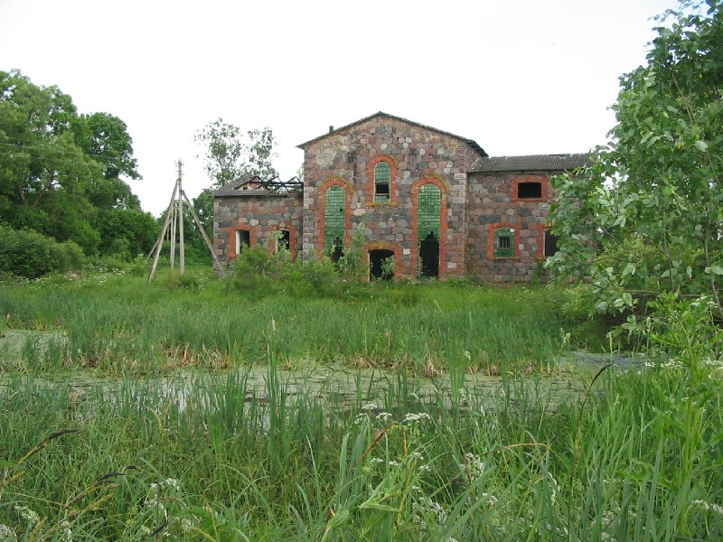
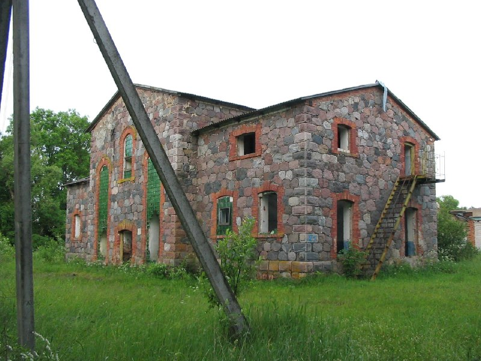
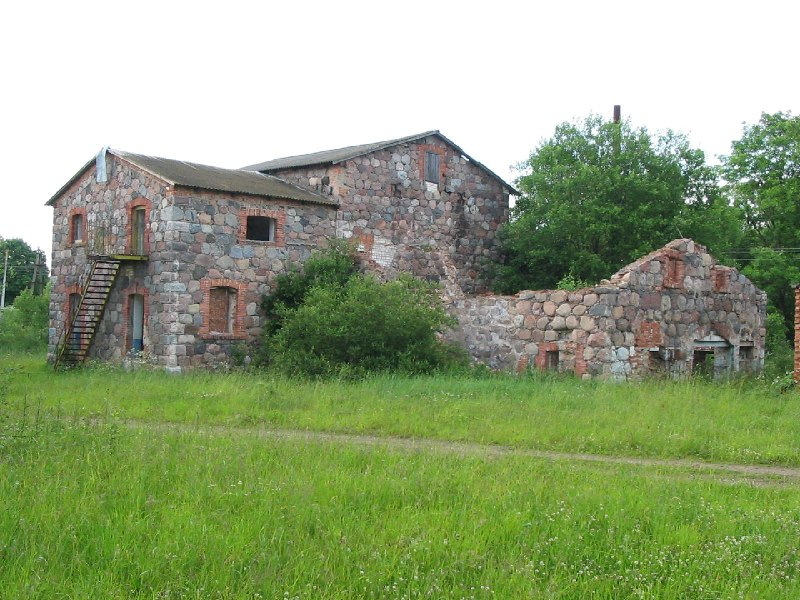

+++
title = ""
date = 2026-03-29T13:33:57+00:00
description = "architecture abandone Свиряны belarus globustut year2005 Source"

[taxonomies]
days = ["2026-03-29"]
tags = ["architecture", "abandone", "Свиряны", "belarus", "globustut", "year_2005"]

[extra]
id = 1532
day = "2026-03-29"
tg_url = "https://t.me/vitaly_zdanevich_chan/1532"
og_image = "01.jpg"
next_id = 1536
next_title = ""
prev_id = 1531
prev_title = ""
views = 18
ids = [1532]
+++

{{ tag(t="architecture") }}  
{{ tag(t="abandone") }}  
{{ tag(t="Свиряны") }}  
{{ tag(t="belarus") }}  
{{ tag(t="globustut") }}  
{{ tag(t="year_2005") }}  

[Source](https://commons.wikimedia.org/wiki/File:059-582_%D0%91%D0%BE%D0%BB_%D0%A1%D0%B2%D0%B8%D1%80%D1%8F%D0%BD%D1%8B,_%D1%81%D0%BD%D1%8F%D1%82%D0%BE_19_%D0%B8%D1%8E%D0%BD%D1%8F_2005.jpg)

