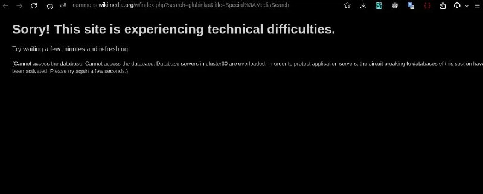

+++
title = ""
date = 2026-04-02T12:08:27+00:00
description = "preservation wikimediacommons unavailable"

[taxonomies]
days = ["2026-04-02"]
tags = ["preservation", "wikimedia_commons", "unavailable"]

[extra]
id = 1567
day = "2026-04-02"
tg_url = "https://t.me/vitaly_zdanevich_chan/1567"
og_image = "5363938150528522306_1248889172_460003394.jpg"
next_id = 1568
next_title = ""
prev_id = 1566
prev_title = ""
views = 21
ids = [1567]
+++

{{ tag(t="preservation") }}  
{{ tag(t="wikimedia_commons") }}  
{{ tag(t="unavailable") }}  

[#1506](@/posts/2026-03-28-1506/index.md)

