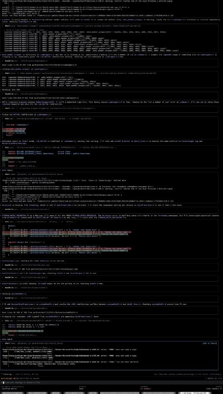

+++
title = ""
date = 2026-04-03T22:17:03+00:00
description = "ai I asked gemini to port primeworld from Windows to Linux, interesting if that possible... We tried wine of course - but some problems with lutris - because native launcher need to run Wine..."

[taxonomies]
days = ["2026-04-03"]
tags = ["ai", "gemini", "prime_world", "wine", "lutris"]

[extra]
id = 1568
day = "2026-04-03"
tg_url = "https://t.me/vitaly_zdanevich_chan/1568"
og_image = "5368664895181755976_1249989703_460002888.jpg"
next_id = 1569
next_title = ""
next_body = "#russianempire\n#typography\n#метрическаякнига\nAt"
prev_id = 1567
prev_title = ""
prev_body = "#preservation\n#wikimediacommons\n#unavailable"
views = 19
ids = [1568]
+++

{{ tag(t="ai") }}  

I asked {{ tag(t="gemini") }} to port {{ tag(t="prime_world") }} from Windows to Linux, interesting if that possible...  

<https://github.com/Prime-World-Classic/Prime-World>  

We tried {{ tag(t="wine") }} of course - but some problems with {{ tag(t="lutris") }} - because native launcher need to run Wine...

