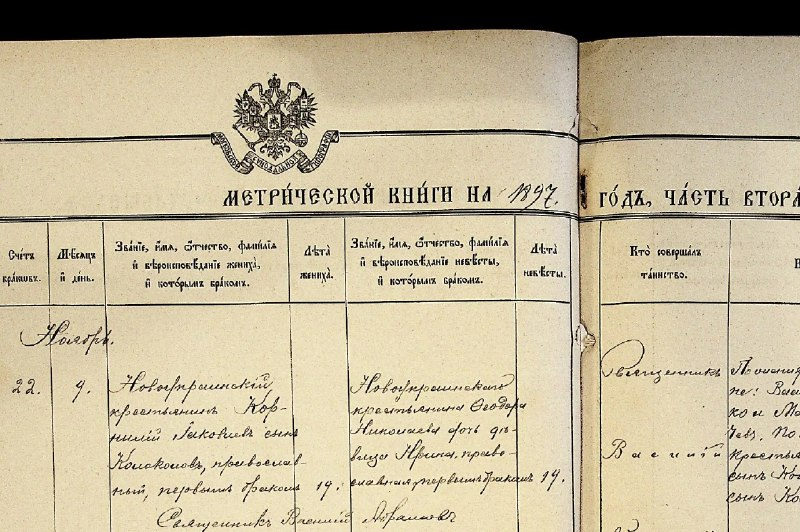

+++
title = ""
date = 2026-04-04T12:56:14+00:00
description = "russianempire typography метрическаякнига At"

[taxonomies]
days = ["2026-04-04"]
tags = ["russian_empire", "typography", "метрическая_книга"]

[extra]
id = 1569
day = "2026-04-04"
tg_url = "https://t.me/vitaly_zdanevich_chan/1569"
og_image = "5370916694995441052_1250513991_460002716.jpg"
next_id = 1570
next_title = ""
next_body = "#ai\n#gpu\n#nvidia"
prev_id = 1568
prev_title = ""
prev_body = "#ai\nI asked #gemini to port #primeworld from Windows to Linux, interesting if that possible...\nWe tried #wine of course - but some problems with #lutris - because native launcher need to run Wine..."
views = 18
ids = [1569]
+++

{{ tag(t="russian_empire") }}  
{{ tag(t="typography") }}  
{{ tag(t="метрическая_книга") }}  

At [https://commons.wikimedia.org/w/index.php?title=Category:ДА\_Кіровоградської\_області\_(Кропивницький)--01\_Фонди\_до\_1917\_року--0139--010139-01-00006&action=edit&redlink=1](https://commons.wikimedia.org/w/index.php?title=Category:%D0%94%D0%90_%D0%9A%D1%96%D1%80%D0%BE%D0%B2%D0%BE%D0%B3%D1%80%D0%B0%D0%B4%D1%81%D1%8C%D0%BA%D0%BE%D1%97_%D0%BE%D0%B1%D0%BB%D0%B0%D1%81%D1%82%D1%96_(%D0%9A%D1%80%D0%BE%D0%BF%D0%B8%D0%B2%D0%BD%D0%B8%D1%86%D1%8C%D0%BA%D0%B8%D0%B9)--01_%D0%A4%D0%BE%D0%BD%D0%B4%D0%B8_%D0%B4%D0%BE_1917_%D1%80%D0%BE%D0%BA%D1%83--0139--010139-01-00006&action=edit&redlink=1)

