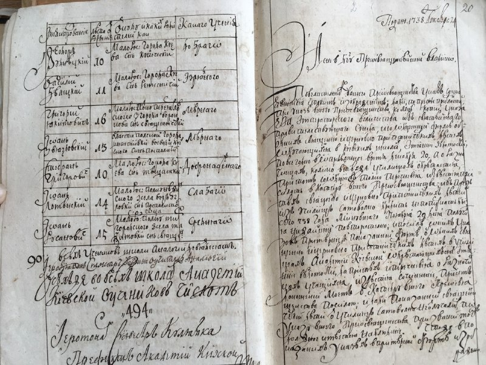
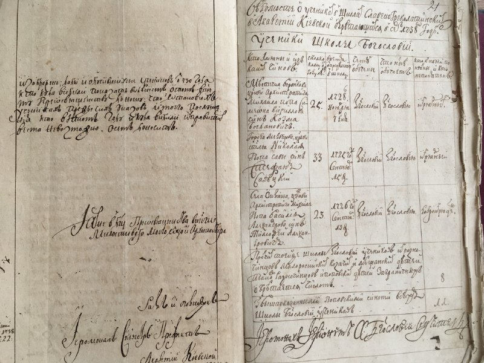
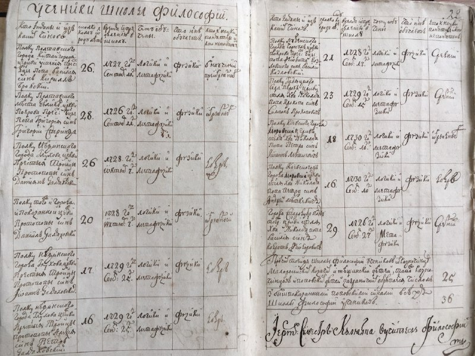
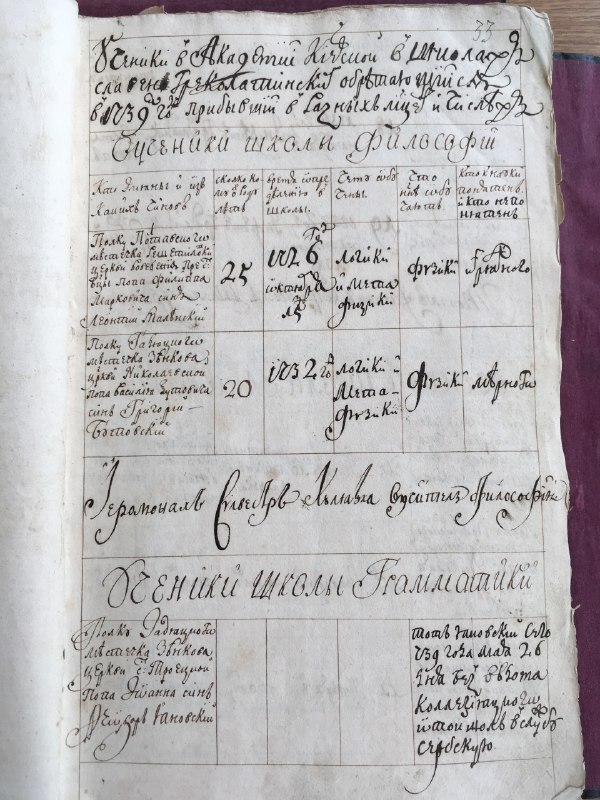
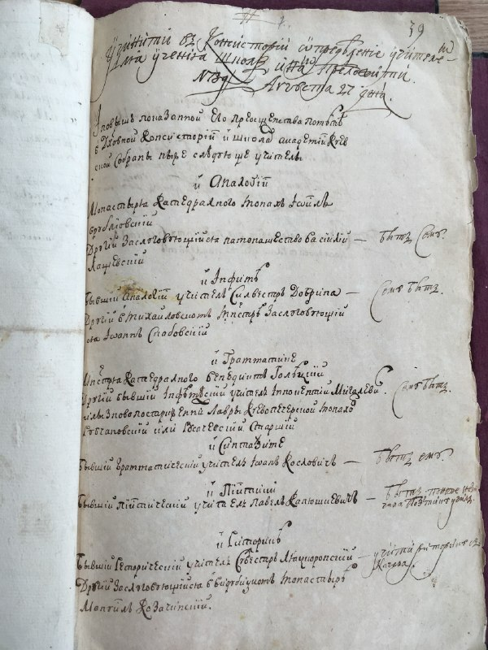
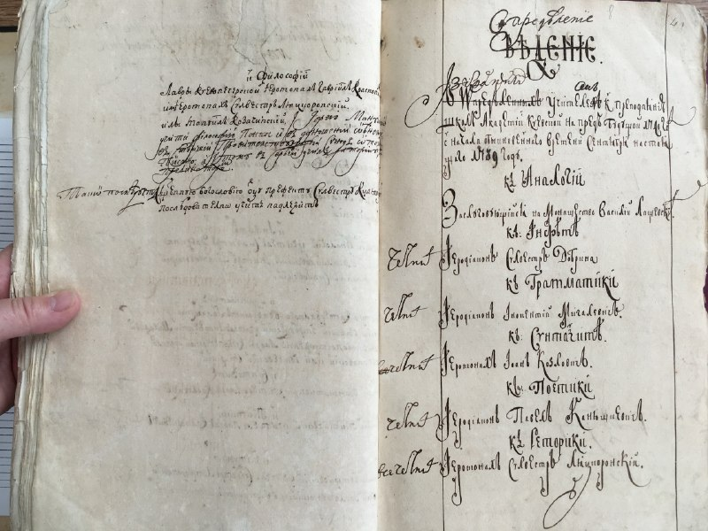
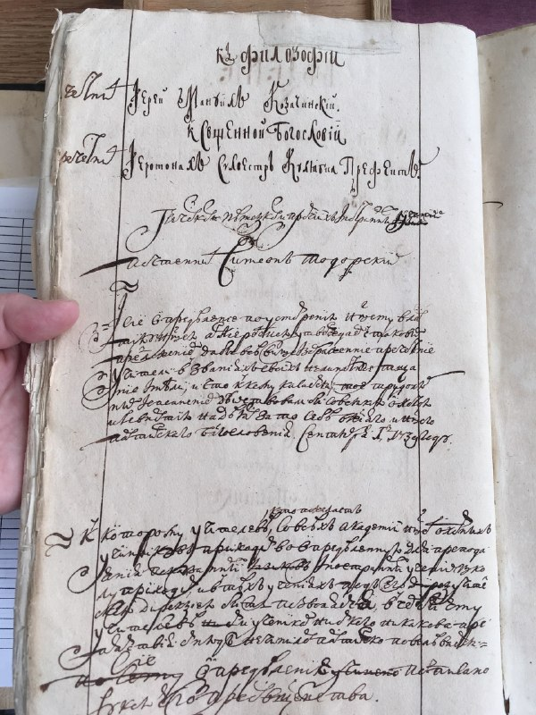
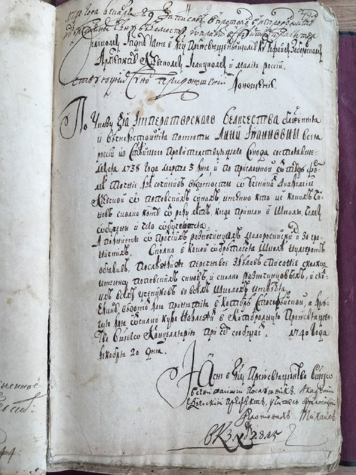

+++
title = "ІР НБУВ - Київська духовна академія 1736-1739 IMG 5099.JPG"
date = 2026-04-06T06:35:25+00:00
description = "ІР НБУВ - Київська духовна академія 1736-1739 IMG 5099.JPG typography scans russianempire kiev 18thcentury"

[taxonomies]
tags = ["typography", "scans", "russian_empire", "kiev", "18th_century"]

[extra]
tg_url = "https://t.me/vitaly_zdanevich_chan/1571"
og_image = "01.jpg"
next_id = 1580
next_title = "ІР НБУВ - Київська духовна академія 1740-1741 IMG 5122 1740.JPG"
prev_id = 1570
prev_title = "ai gpu nvidia"
views = 15
ids = [1571]
+++

[ІР НБУВ - Київська духовна академія 1736-1739 IMG 5099.JPG](https://commons.wikimedia.org/wiki/File:%D0%86%D0%A0_%D0%9D%D0%91%D0%A3%D0%92_-_%D0%9A%D0%B8%D1%97%D0%B2%D1%81%D1%8C%D0%BA%D0%B0_%D0%B4%D1%83%D1%85%D0%BE%D0%B2%D0%BD%D0%B0_%D0%B0%D0%BA%D0%B0%D0%B4%D0%B5%D0%BC%D1%96%D1%8F_1736-1739_IMG_5099.JPG)

{{ tag(t="typography") }}
{{ tag(t="scans") }}
{{ tag(t="russian_empire") }}
{{ tag(t="kiev") }}
{{ tag(t="18th_century") }}

