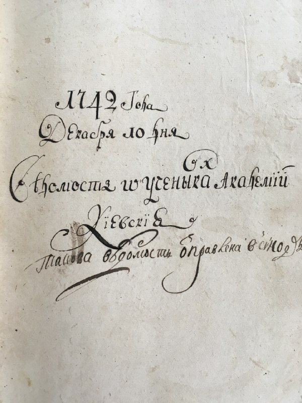
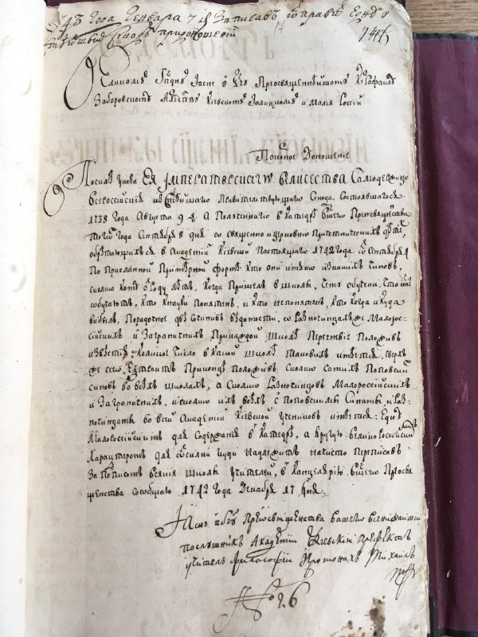
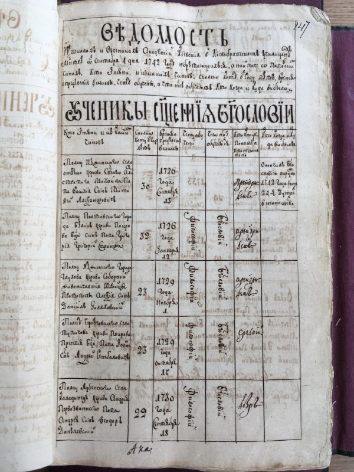
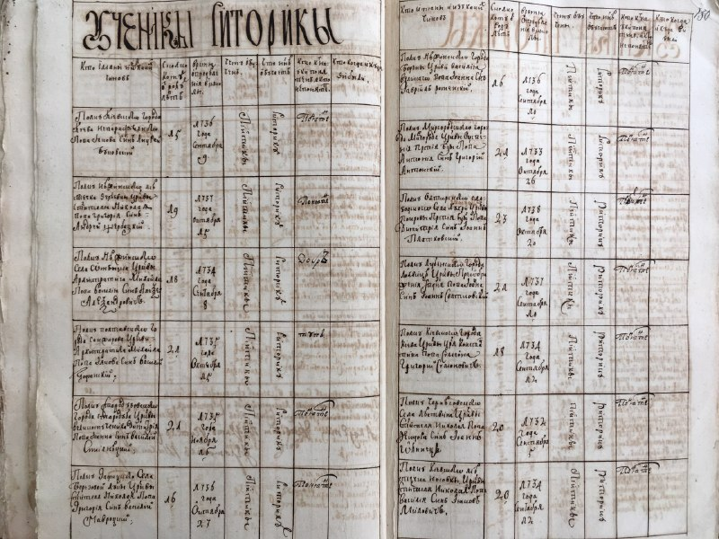
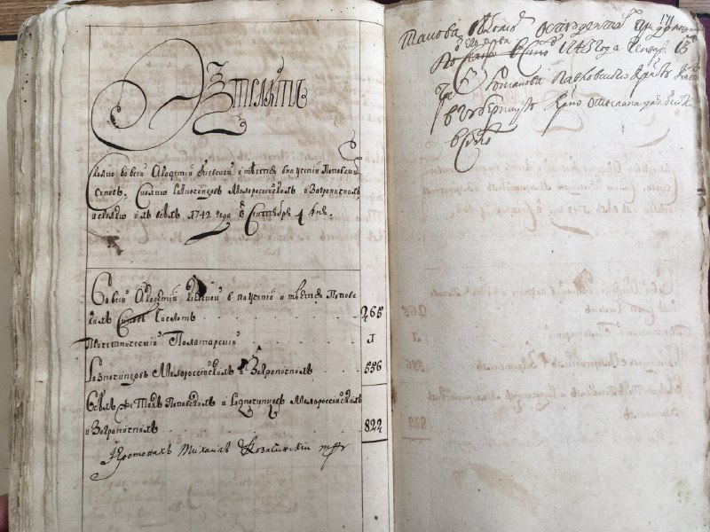

+++
title = ""
date = 2026-04-06T06:52:32+00:00
description = "typography scans russianempire kiev 18thcentury"

[taxonomies]
days = ["2026-04-06"]
tags = ["typography", "scans", "russian_empire", "kiev", "18th_century"]

[extra]
id = 1590
day = "2026-04-06"
tg_url = "https://t.me/vitaly_zdanevich_chan/1590"
og_image = "01.jpg"
next_id = 1595
next_title = ""
next_body = "#indika\n#game\n#religion\n#christianity\n#webdesign"
prev_id = 1580
prev_title = ""
prev_body = "#typography\n#scans\n#russianempire\n#kiev\n#18thcentury"
views = 23
ids = [1590]
+++

{{ tag(t="typography") }}  
{{ tag(t="scans") }}  
{{ tag(t="russian_empire") }}  
{{ tag(t="kiev") }}  
{{ tag(t="18th_century") }}  

[https://commons.wikimedia.org/wiki/File:ІР\_НБУВ\_-\_Київська\_духовна\_академія\_1742\_IMG\_5180\_1742.JPG](https://commons.wikimedia.org/wiki/File:%D0%86%D0%A0_%D0%9D%D0%91%D0%A3%D0%92_-_%D0%9A%D0%B8%D1%97%D0%B2%D1%81%D1%8C%D0%BA%D0%B0_%D0%B4%D1%83%D1%85%D0%BE%D0%B2%D0%BD%D0%B0_%D0%B0%D0%BA%D0%B0%D0%B4%D0%B5%D0%BC%D1%96%D1%8F_1742_IMG_5180_1742.JPG)

