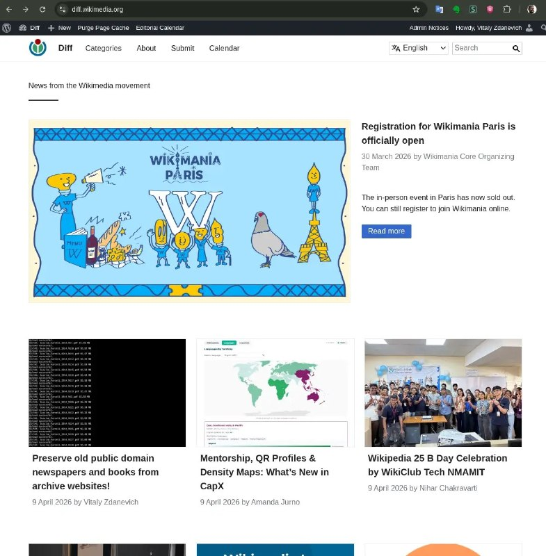

+++
title = "My first blog post to wikimedia_diff, about wikimedia_commons, preservation"
date = 2026-04-09T11:01:17+00:00
description = "My first blog post to wikimediadiff, about wikimediacommons, preservation Also at"

[taxonomies]
tags = ["post", "wikimedia_diff", "wikimedia_commons", "preservation"]

[extra]
tg_url = "https://t.me/vitaly_zdanevich_chan/1599"
og_image = "5384230363468600311_1253613821_460002295.jpg"
next_id = 1600
next_title = "icq offline abandone sony_ericsson"
prev_id = 1595
prev_title = "indika game religion christianity webdesign"
views = 19
ids = [1599]
+++

My first blog {{ tag(t="post") }} to {{ tag(t="wikimedia_diff") }}, about {{ tag(t="wikimedia_commons") }}, {{ tag(t="preservation") }}

<https://diff.wikimedia.org/2026/04/09/preserve-old-public-domain-newspapers-and-books-from-archive-websites/>

Also at <https://habr.com/en/articles/1025750/>

