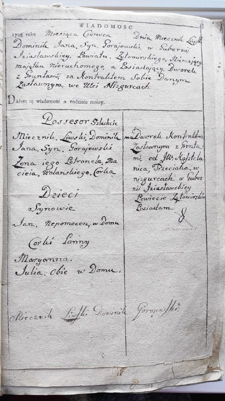
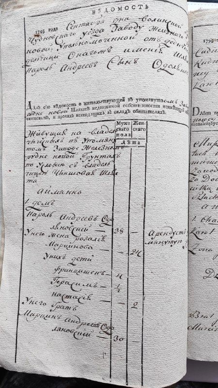
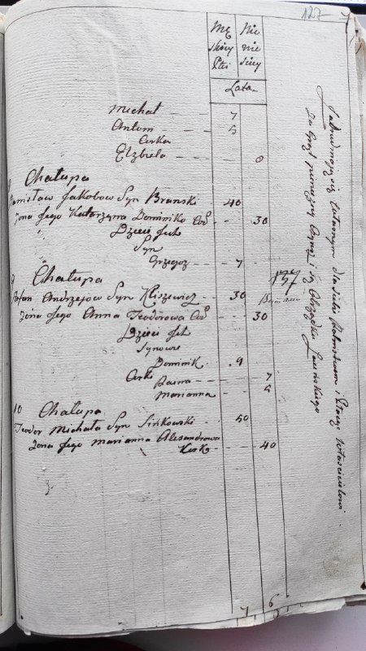
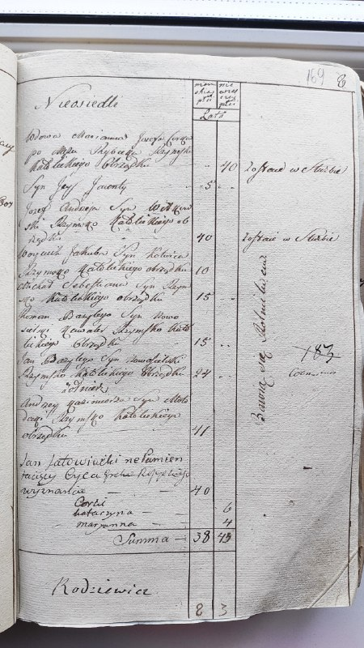
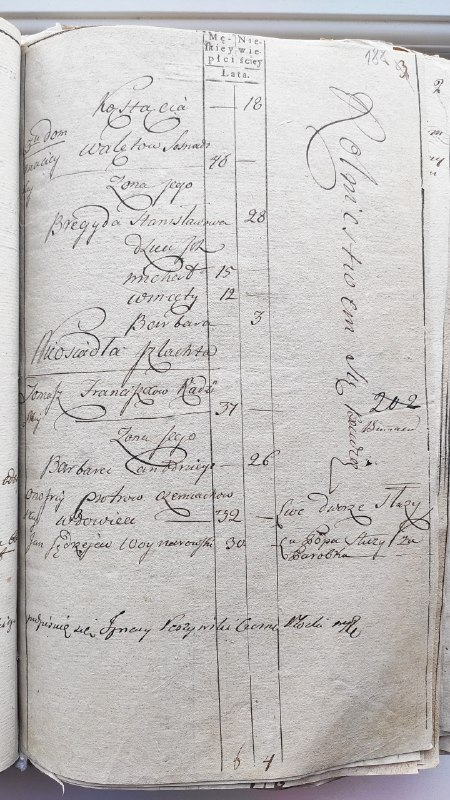
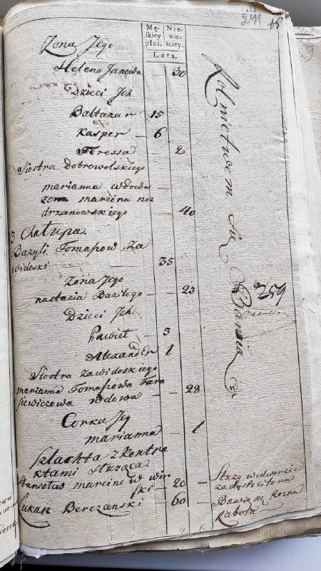
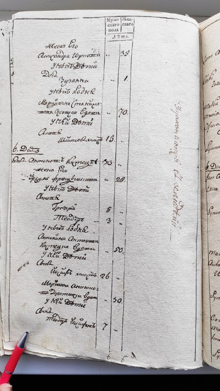
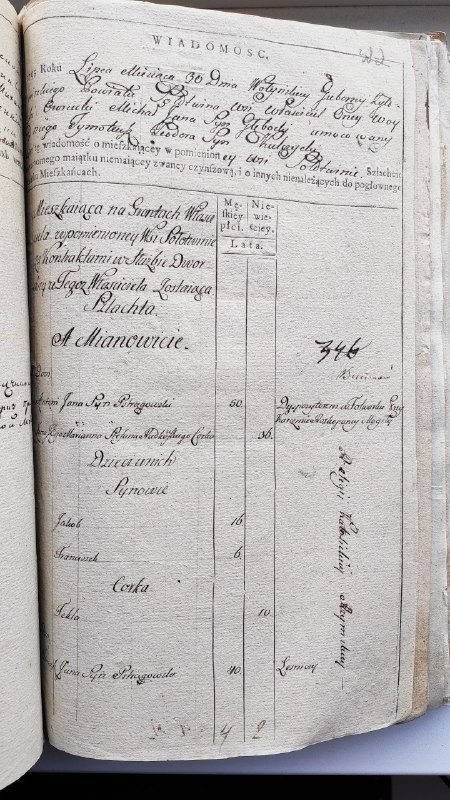
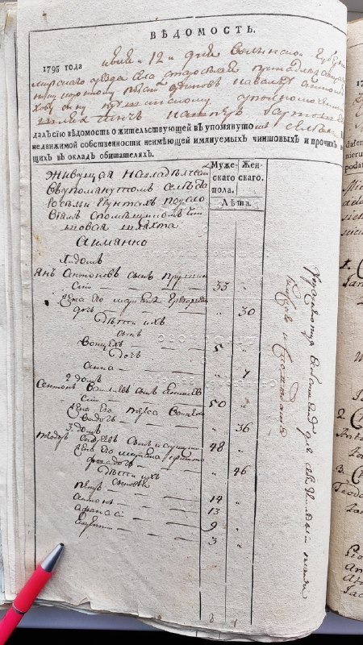
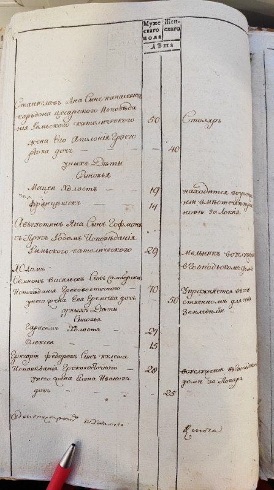

+++
title = "ДА Житомирської області--01 Ф - фонди дорадянського періоду--0118--010118-14--010118-14-00018 IMG 20200124 152116.jpg"
date = 2026-04-11T10:15:34+00:00
description = "ДА Житомирської області--01 Ф - фонди дорадянського періоду--0118--010118-14--010118-14-00018 IMG 20200124 152116.jpg typography russianempire century18"

[taxonomies]
tags = ["typography", "russian_empire", "century18"]

[extra]
tg_url = "https://t.me/vitaly_zdanevich_chan/1602"
og_image = "01.jpg"
next_id = 1612
next_title = "I wrote, with ai, a nice script to find top biggest folders - that has no other subfolders (leaf folders)"
prev_id = 1600
prev_title = "icq offline abandone sony_ericsson"
views = 16
ids = [1602]
+++

[ДА Житомирської області--01 Ф - фонди дорадянського періоду--0118--010118-14--010118-14-00018 IMG 20200124 152116.jpg](https://commons.wikimedia.org/wiki/File:%D0%94%D0%90_%D0%96%D0%B8%D1%82%D0%BE%D0%BC%D0%B8%D1%80%D1%81%D1%8C%D0%BA%D0%BE%D1%97_%D0%BE%D0%B1%D0%BB%D0%B0%D1%81%D1%82%D1%96--01_%D0%A4_-_%D1%84%D0%BE%D0%BD%D0%B4%D0%B8_%D0%B4%D0%BE%D1%80%D0%B0%D0%B4%D1%8F%D0%BD%D1%81%D1%8C%D0%BA%D0%BE%D0%B3%D0%BE_%D0%BF%D0%B5%D1%80%D1%96%D0%BE%D0%B4%D1%83--0118--010118-14--010118-14-00018_IMG_20200124_152116.jpg)

{{ tag(t="typography") }}
{{ tag(t="russian_empire") }}
{{ tag(t="century18") }}

