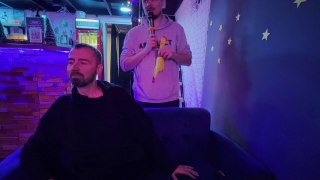

+++
title = ""
date = 2026-04-11T12:14:28+00:00
description = "Про викиданные/wikidata (открытая база данных на SPARQL), wikimedia, wikipedia Моя лекция/митап в laboratorybar (это бар в batumi). Все линки на видео"

[taxonomies]
days = ["2026-04-11"]
tags = ["викиданные", "wikidata", "SPARQL", "wikimedia", "wikipedia", "лекция", "laboratory_bar", "batumi"]

[extra]
id = 1622
day = "2026-04-11"
tg_url = "https://t.me/vitaly_zdanevich_chan/1622"
og_image = "01.jpg"
next_id = 1623
next_title = ""
next_body = "Usual #school in #china? #lenin\n【【城】一行代码让整个网站瘫痪，永不过时的黑客技术】"
prev_id = 1613
prev_title = ""
prev_body = "#typography\n#russianempire\n#ukraine\n#century18\nSource"
views = 25
ids = [1622]

[[extra.related]]
path = "@/posts/2026-02-01-1070/index.md"
label = "#logo #wikimedia #wikidata #data From"

[[extra.related]]
path = "@/posts/2026-05-16-1762/index.md"
label = "#лекция про мой #telegram #бот для #evernote #stillyoungbar #bat…"

[[extra.related]]
path = "@/posts/2026-07-23-2067/index.md"
label = "Моя #лекция про #evernote проекты, #saas, #everpublich на #zola…"

[[extra.related]]
path = "@/posts/2026-06-21-1848/index.md"
label = "#batumi Oh my, I live here From"

[[extra.related]]
path = "@/posts/2026-02-02-1073/index.md"
label = "#wikipedia Актёр озвучивания мужского пола Монгильо наиболее изв…"
+++

Про {{ tag(t="викиданные") }}/{{ tag(t="wikidata") }} (открытая база данных на {{ tag(t="SPARQL") }}), {{ tag(t="wikimedia") }}, {{ tag(t="wikipedia") }}  

Моя {{ tag(t="лекция") }}/митап в {{ tag(t="laboratory_bar") }} (это бар в {{ tag(t="batumi") }}).  

<https://www.wikidata.org/wiki/User:Vitaly_Zdanevich>  

Все линки на видео <https://share.evernote.com/note/73621155-4b57-e6c1-1c69-8ee7b423b252>

*▶ video — 1:10:25*
