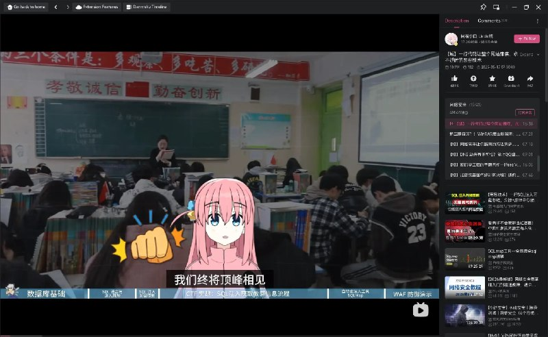

+++
title = "Usual school in china?"
date = 2026-04-11T23:26:15+00:00
description = "Usual school in china? lenin 【【城】一行代码让整个网站瘫痪，永不过时的黑客技术】"

[taxonomies]
tags = ["school", "china", "lenin"]

[extra]
tg_url = "https://t.me/vitaly_zdanevich_chan/1623"
og_image = "5391330184927058070_1255266877_460003478.jpg"
next_id = 1624
next_title = "preview on bilibili"
prev_id = 1622
prev_title = "Про викиданные/wikidata (открытая база данных на SPARQL), wikimedia, wikipedia"
views = 22
ids = [1623]
+++

Usual {{ tag(t="school") }} in {{ tag(t="china") }}? {{ tag(t="lenin") }}

【【城】一行代码让整个网站瘫痪，永不过时的黑客技术】<https://www.bilibili.com/video/BV1ZXE4ziEgf?vd_source=bb5efb0fc5b9ab1f523b5e6d0a9f0a2f>

