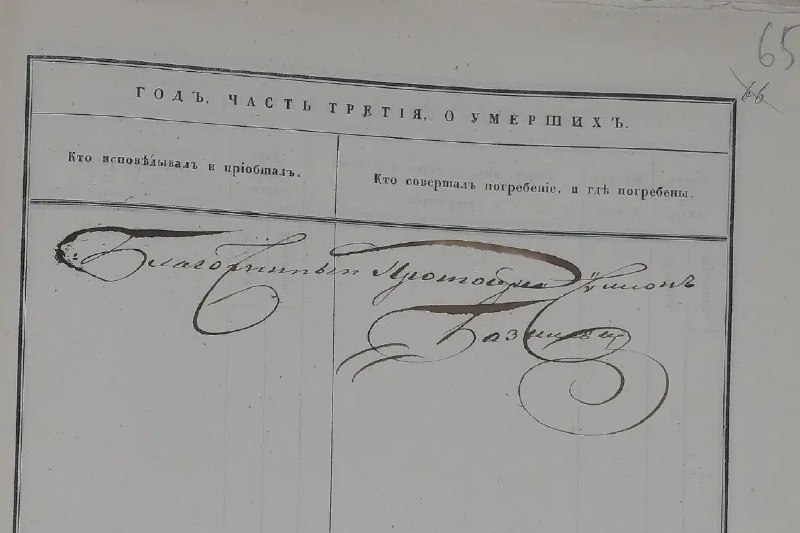
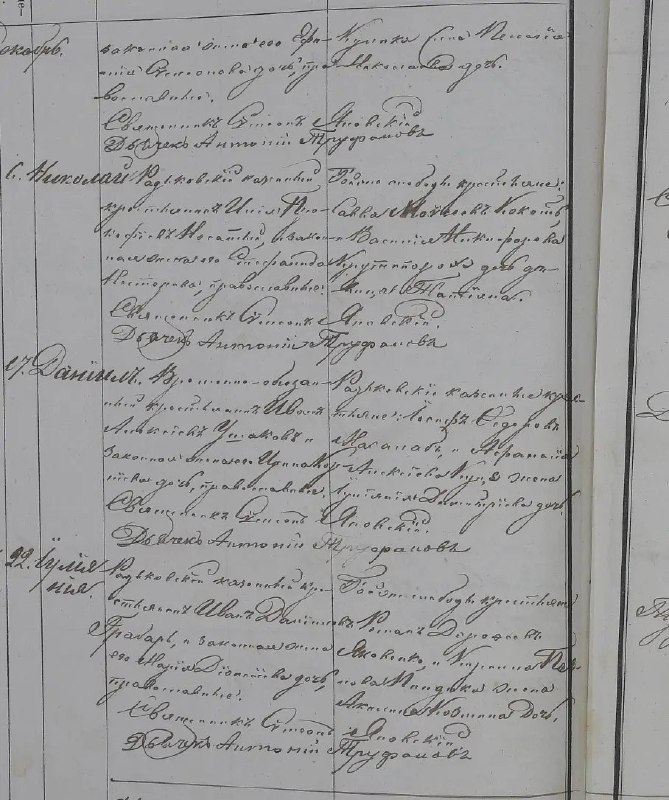
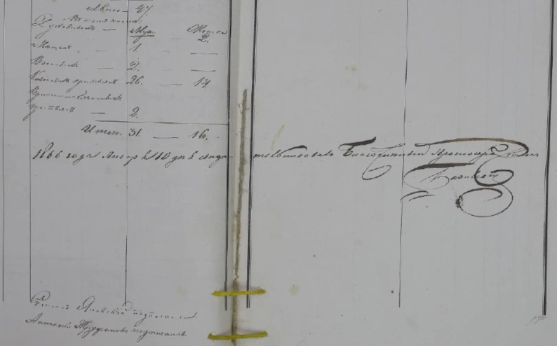
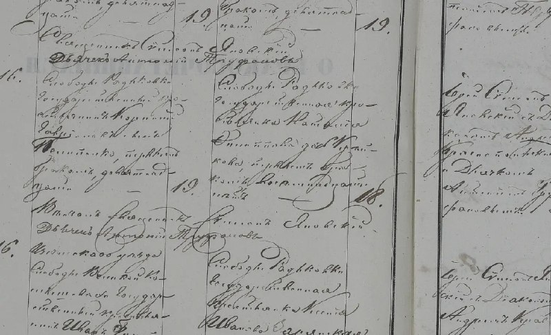
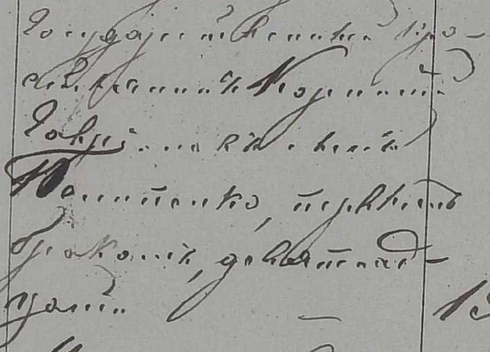
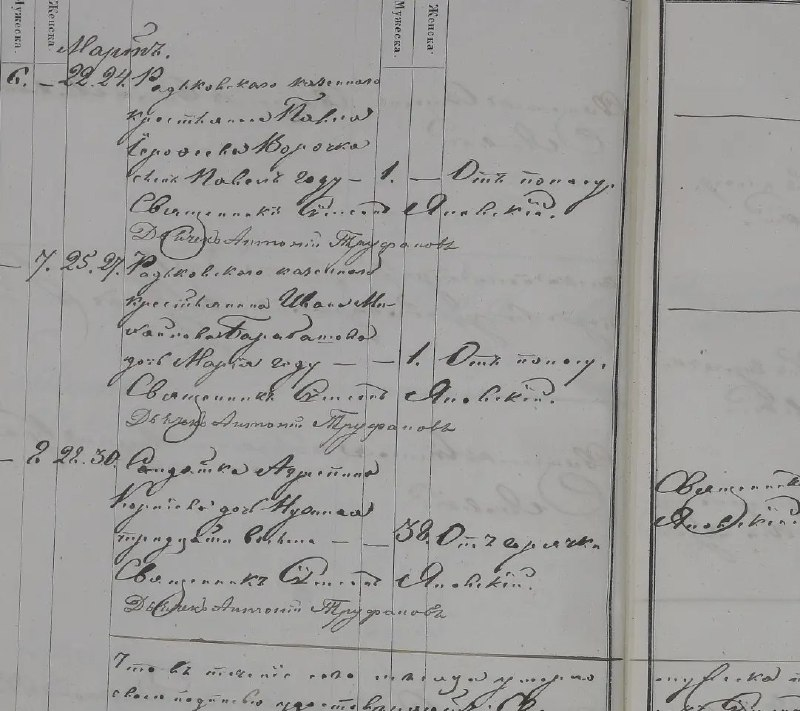
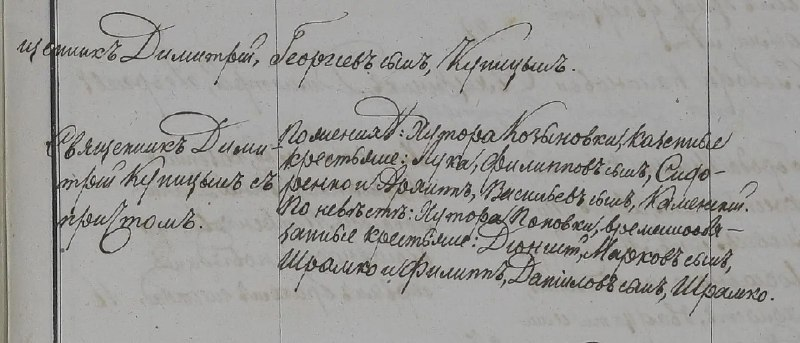

+++
title = "ДА Харківської області--01--0040--0105--010040-105-00969 804-03494422-l-m-a-40-105-969-0670.jpg"
date = 2026-04-12T10:36:32+00:00
description = "ДА Харківської області--01--0040--0105--010040-105-00969 804-03494422-l-m-a-40-105-969-0670.jpg typography russianempire ukraine century18"

[taxonomies]
tags = ["typography", "russian_empire", "ukraine", "century18"]

[extra]
tg_url = "https://t.me/vitaly_zdanevich_chan/1629"
og_image = "01.jpg"
next_id = 1636
next_title = "linux france news"
prev_id = 1624
prev_title = "preview on bilibili"
views = 18
ids = [1629]
+++

[ДА Харківської області--01--0040--0105--010040-105-00969 804-03494422-l-m-a-40-105-969-0670.jpg](https://commons.wikimedia.org/wiki/File:%D0%94%D0%90_%D0%A5%D0%B0%D1%80%D0%BA%D1%96%D0%B2%D1%81%D1%8C%D0%BA%D0%BE%D1%97_%D0%BE%D0%B1%D0%BB%D0%B0%D1%81%D1%82%D1%96--01--0040--0105--010040-105-00969_804-03494422-l-m-a-40-105-969-0670.jpg)

{{ tag(t="typography") }}
{{ tag(t="russian_empire") }}
{{ tag(t="ukraine") }}
{{ tag(t="century18") }}

